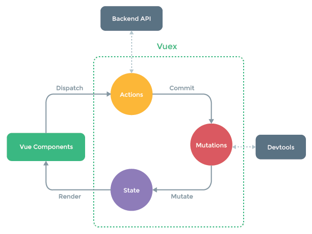
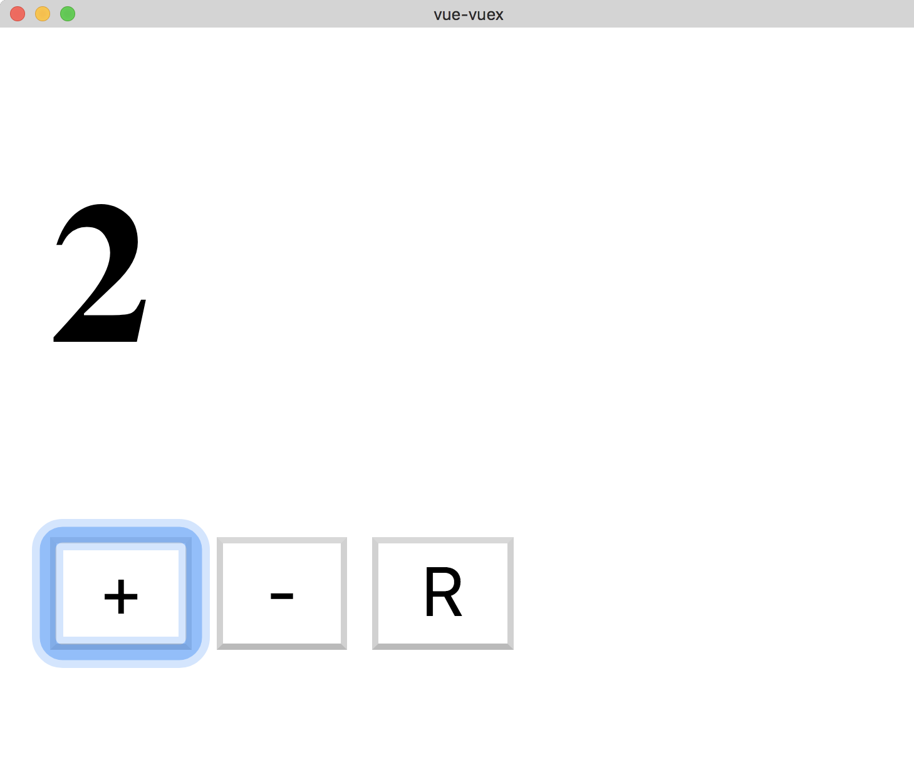
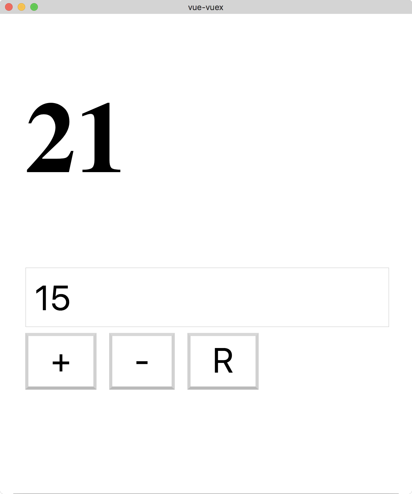
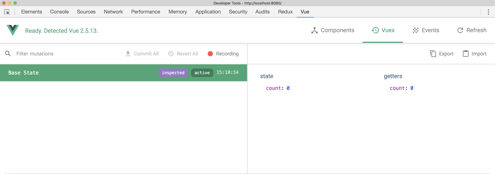
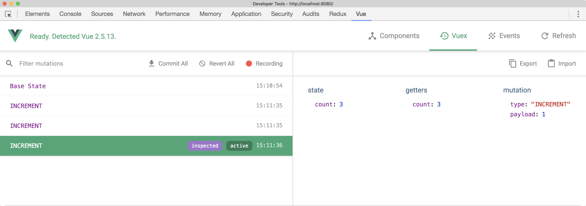

**********
使用vuex状态管理
**********
在本章中，我们将使用 ``Vuex`` 来研究状态管理模式。 对于每个创建的应用程序来说， ``Vuex`` 可能不是必需的，但是了解它适合使用情况以及如何实现它时，它是非常重要的。

到本章结束时，您将完成以下工作：

- 了解 ``Vuex`` 是什么以及为什么你应该使用它；
- 创建你的第一个 ``Vuex`` store；
- 探究 ``actions`` ， ``mutations`` ， ``getters`` ，和 ``modules`` ；
- 使用 ``Vue devtools`` 在它们发生时逐步进入 ``Vuex`` mutations；

Vuex是什么
==========
状态管理是现代 ``Web`` 应用程序的重要组成部分，随着应用程序的增长，管理这种状态是每个项目面临的问题。 ``Vuex`` 希望通过实施集中式存储来帮助我们实现更好的状态管理，这在我们的应用程序中基本上是单一的真实来源。 它遵循与 ``Flux`` 和 ``Redux`` 类似的设计原则，并且与官方的 ``Vue devtools`` 集成在一起，获得了良好的开发体验。

到目前为止，我已经谈到了状态和管理状态，但您可能仍然感到困惑。 让我们更深入地定义这些术语。

状态管理模式(SMP)
-----------------
我们可以将状态定义为组件或应用程序中变量/对象的当前值。如果我们将功能看作简单的 ``INPUT -> OUTPUT`` 机器，那么存储在这些功能之外的值就构成了我们应用程序的当前状态（状态）。

请注意我是如何区分 **组件级别** 和 **应用程序级别** 状态的。组件级别状态可以被定义为仅限于一个组件的状态（即组件内的数据函数）。应用程序级别状态相似，但通常用于多个组件或服务。

随着我们的应用程序的不断增长，跨多个组件传递状态变得更加困难。我们在本书的前面看到，我们可以使用事件总线（即全局 ``Vue`` 实例）来传递数据，虽然这样做有效，但将我们的状态定义为单一集中式存储的一部分会更好。这使我们能够更轻松地推理应用程序中的数据，因为我们可以开始定义操作和始终生成新版本状态的变化，并且管理状态变得更加系统化。

事件总线是一种简单的方法来依靠单一的视图实例进行状态管理，并且可能对小型 ``Vuex`` 项目有益，但在大多数情况下，应该使用 ``Vuex`` 。随着我们的应用程序变得更大，使用 ``Vuex`` 明确定义我们的行为和预期的副作用，可以使我们更好地管理和扩展项目。

下面的屏幕截图(https://vuex.vuejs.org/en/intro.html)中可以看到所有这些如何结合在一起的一个很好的例子：



让我们把这个例子分解成一个循序渐进的过程：

1. 初始 ``State`` 在 ``Vue`` 组件内部渲染；
2. ``Vue`` 组件调度 ``Action`` 以从后端 ``API`` 获取一些数据；
3. 然后触发一个由 ``Mutation`` 处理的 ``Commit`` 事件。此 ``Mutation`` 返回包含来自后端 ``API`` 的数据的新版本状态；
4. 这个过程可以在 ``Vue Devtools`` 中看到，并且您可以在应用程序中之前发生的不同版本的状态之间进行“时间旅行”；
5. 然后新的 ``State`` 在 ``Vue``` 组件内部渲染；

因此，我们的 ``Vuex`` 应用程序的主要组成部分是 ``store`` ，是所有组件的单一真相源。 ``store`` 可以读，但不能直接更改；它必须具有 ``mutation`` 函数才能执行任何更改。尽管这种模式起初看起来很奇怪，但如果您之前从未使用过状态容器，则此设计允许我们以一致的方式向应用程序添加新功能。

由于 ``Vuex`` 本身就是为了与 ``Vue`` 一起工作而设计的，因此该商店默认为反应式。这意味着可以实时查看 ``store`` 内发生的任何变化，而无需任何黑客手段。


为什么要用vuex
^^^^^^^^^^^^^^^
不知道读者是否有看过 ``Vue2.0`` 子父组件之间通信，子父组件之间的基本通信方式。我们通信的目的往往就是在组件之间传递数据或组件的状态（这里将数据和状态统称为状态），进而更改状态。但可以看到如果我们通过最基本的方式来进行通信，一旦需要管理的状态多了，代码就会变得十分混乱。对所有状态的管理便会显得力不从心，尤其是多人合作的时候。

此时 ``vuex`` 出现了，他就是帮助我们把公用的状态全抽出来放在 ``vuex`` 的容器中，然后根据一定的规则来进行管理。

Vuex的核心
^^^^^^^^^^^
``vuex`` 由以下几部分组成：

- state
- mutations
- getters
- actions
- modules

详解：

- **state** 里面就是存放项目中需要多组件共享的状态；
- **mutations** 就是存放更改 ``state`` 里状态的方法；
- **getters** 就是从 ``state`` 中派生出状态，比如将 ``state`` 中的某个状态进行过滤然后获取新的状态；
- **actions** 就是 ``mutation`` 的加强版，它可以通过 ``commit mutations`` 中的方法来改变状态，最重要的是它可以进行异步操作。
- **modules** 顾名思义，就是当用这个容器来装这些状态还是显得混乱的时候，我们就可以把容器分成几块，把状态和管理规则分类来装。这和我们创建 ``js`` 模块是一个目的，让代码结构更清晰。

.. code-block:: js

    // 实例化vuex状态库
    var vuexStore = new Vuex.Store({
        state:{
            message:'Hello World',
            bookList:[
                {
                    name:'javascript权威指南',
                    price:100,
                    en:'jq'
                },
                {
                    name:'angularjs权威指南',
                    price:80,
                    en:'aq'
                },
                {
                    name:'HTTP权威指南',
                    price:50,
                    en:'hq'
                }
            ]
        },
        mutations:{
            //同步
            showMessage:function(state,data){
                state.message = 'Store mutations changed this words。'+data;
            }
            addBook:function(state,data){
                state.bookList.push(data)
            }
        },
        getters:{
            filterPrice:function(state){
                var narr = [];
                for(var i = 0;i<state.bookList.length;i++){
                    state.bookList[i].price<85 ? narr.push(state.bookList[i]) : null;
                }
                return narr;
            }
        },
        actions:{
            //异步操作
            addBook:function(context){
                setTimeout(function(){
                    context.commit('addBook',{name:'HTML5权威指南',price:75});
                },2000);
            }
        },
        modules:{
            a:storeA,b:storeB
        }
    });

    // vue 实例
    var vm = new Vue({
        el:'app',
        store:VuexStore,
        methods:{
            showMessage:function(){
                this.$store.commit('showMessage','荷载数据')
            },
            filterList:function(){
                return this.store.getters.filterPrice();
            },
            addBooks:function(){
                this.$store.dispatch('addBook')
            },
        }
    });

- 【state】 ``vuex`` 核心概念有五个，试想当我们把所有的状态从各个组件抽出来，放入了 ``state`` 中： ``message`` 和 ``bookList`` ；
- 【mutations】某个时候，某个组件中，我们改变 ``state`` 中的 ``message`` 数据，我们要通过调用 ``commit`` 方法提交到 ``mutations`` 对应的事件： ``commit('showMessage')`` ，这样就会调用 ``mutations`` 里 ``showMessage`` 方法；调用方法是如上面代码中57行的方式；
- 【getters】某个时间，某个组件我们需要获得 ``bookList`` 中价格小于 ``85`` 的所有数据， ``vuex`` 中允许我们通过 ``getters`` 来获取：使用方法如上代码中60行；
- 【actions】这个是 ``mutations`` 的强化部分，只是这个里面的函数可以异步操作，比如网络请求等等；这里面的方法如果要更改状态，最好要通过 ``commit()`` 函数提交到 ``mutations`` 里去处理。官方是这么说的。在实例里调用一般是通过 ``dispatch('funName')`` 来调用的；例如实例中：66行代码；
- 【关于moduls】 ``modules`` 其实就是多个状态管理库，放在一个对象里，比如我们有2个状态库： ``storeA`` ， ``storeB`` 。我们在 ``modules`` 里就和上面代码中50行的写法是一样的。

在取值的时候就直接在实例里调用： ``this.$store.state.a`` 即可返回 ``storeA`` 这个 ``store`` 里的状态。

这里有一个点要注意一下：所有子模块里的 ``getters`` 对象里的方法会被合并到 ``$store`` 里，如果不同子模块里有重名的方法，那么会报错；

但是所有子模块里 ``actions`` 和 ``mutations`` 中的方法不会被合并，重名也不会报错。但是当你 ``dispatch`` 或者 ``commit`` 一个同名的事件的时候，会依次执行每一个子模块中的事件。

所以在不同子模块的 ``actions`` 和 ``mutations`` 中不要写重复的函数名称；

使用Vuex
^^^^^^^^^
下面我们来讲一下怎么引入一个 ``Vuex`` 协助我们管理状态：

首先当然要引入 ``Vuex.js`` ；

然后，我们新建一个 ``vuex`` 实例

.. code-block:: js

    var store = new VuexStore({
        state: {},
        mountations: {},
    })

创建好 ``store`` 后我们需要把这个 ``store`` 注入到 ``vue`` 的实例和组件中：

.. code-block:: js

    var vm = new Vue({
        el: '#app',
        store: store
    })

关于状态的思考
--------------
作为一个思考练习，我们首先定义应用程序的目标以及任何 ``state`` ， ``actions`` 和潜在的 ``mutations`` 。 您不必将以下代码添加到您的应用程序中，因此请随时阅读，最后我们会将它们结合在一起。

我们首先将 ``state`` 视为键/值对的集合：

.. code-block:: js

    const state = {
        count: 0 // number
    }

对于我们的计数器应用程序，我们只需要一个状态元素 - 当前计数。 这可能会有一个默认值 ``0`` ，将是类型的数字。 由于这可能是我们应用程序内部的唯一状态，因此您可以将此状态视为此时的应用程序级别。

接下来，我们来考虑一下用户可能想要使用计数器的任何操作类型。

然后可以将这三种动作类型分派给 ``store`` ，因此我们可以执行以下 ``mutations`` ，每次都返回一个新版本的状态：

- Increment：当前计数增加1（0 - > 1）；
- Decrement：当前计数中减1（1 - > 0）；
- Reset：当前计数设置回0（n - > 0）；

至此，我们可以想象，我们的用户界面将更新为正确的绑定版本。 让我们来实现这一点，并将其变为现实。

使用vuex
========
现在我们已经详细了解了由 ``Vuex`` 驱动的应用程序的组成部分，我们来做一个演示项目以利用这些功能！

在终端中运行以下内容：

.. code-block:: shell

    # Create a new Vue project
    $ vue init webpack-simple vuex-counter

    # Navigate to directory
    $ cd vuex-counter

    # Install dependencies
    $ npm install

    # Install Vuex
    $ npm install vuex

    # Run application
    $ npm run dev

创建一个新的store
-----------------
我们先在 ``src/store`` 里创建一个名为 ``index.js`` 的文件。 这是我们用来创建新 ``store`` 并汇集各种组件的文件。

我们可以先导入 ``Vue`` 和 ``Vuex`` ，并告诉 ``Vue`` 我们想使用 ``Vuex`` 插件：

.. code-block:: js

    import Vue from 'vue';
    import Vuex from 'vuex';

    Vue.use(Vuex);

然后，我们可以使用包含所有应用程序状态的状态对象作为参数转入新的 ``Vuex.Store`` 并导出。 我们正在导出这个，以便我们可以在必要时将其他组件中的状态导入：

.. code-block:: js

    export default new Vuex.Store({
        state: {
            count: 0,
        },
    });

定义动作类型
------------
然后，我们可以在 ``src/store`` 内创建一个名为 ``mutation-types.js`` 的文件，其中包含用户在我们的应用程序中可能采取的各种 ``actions`` ：

.. code-block:: js

    export const INCREMENT = 'INCREMENT';
    export const DECREMENT = 'DECREMENT';
    export const RESET = 'RESET';

尽管我们不必像这样显式地定义我们的行为，但尽可能使用常量是个好主意。 这使我们能够更好地利用工具和提示，并让我们一眼就能够推断出整个应用程序中的操作。

Actions
-------
我们可以使用这些动作类型来执行一个新的 ``action`` ，以便随后由我们的 ``mutations`` 处理。 在 ``src/store`` 中创建一个名为 ``actions.js`` 的文件：

.. code-block:: js

    import * as types from './mutation-types';

    export default { // 这里的方法应该调用mutations中方法来修改状态
        [types.INCREMENT]({ commit }) {
            commit(types.INCREMENT);
        },
        [types.DECREMENT]({ commit }) {
            commit(types.DECREMENT);
        },
        [types.RESET]({ commit }) {
            commit(types.RESET);
        },
    };

在每个方法内部，我们解构 ``sotre`` 对象的 ``commit`` 函数并作为参数传入。(注意这里的语法) 如果我们不这样做，我们必须像这样调用 ``commit`` 函数：

.. code-block:: js

    export default {
        [types.INCREMENT](store) {
            store.commit(types.INCREMENT);
        }
    }

如果我们重新审视我们的状态图，我们可以看到，在提交动作之后，动作由 ``mutator`` 拾取。

Mutations
----------
``mutation`` 是 ``store`` 状态可以改变的唯一方法；如前所述，这是通过 ``committing/dispatching`` 动作完成的。 让我们在 ``src/store`` 里创建一个名为 ``mutations.js`` 的新文件并添加如下内容：

.. code-block:: js

    import * as types from './mutation-types';

    export default { // 这里的方法直接修改状态值
        [types.INCREMENT](state) {// 传入状态对象
            state.count++;
        },
        [types.DECREMENT](state) {
            state.count--;
        },
        [types.RESET](state) {
            state.count = 0;
        },
    };

您会再次注意到，我们正在使用我们的操作类型来定义方法名称；这可以通过名为计算属性名称的 ``ES2015 +`` 中的新功能来实现。现在，任何时候一个动作被 ``committing/dispatching`` ， ``mutator`` 将知道如何处理这个并返回一个新的状态。

Getters
-------
我们现在可以提交操作并使这些操作返回状态的新版本。 下一步是创建 ``getter`` ，以便我们可以在我们的应用程序中返回状态的经过处理的值。 让我们在 ``src/store`` 中创建一个名为 ``getters.js`` 的新文件并添加以下内容：

.. code-block:: js

    export default { // 这里的方法不能修改只能获取状态的过滤值
        count(state) {
            return state.count;
        },
    };

对于这个很小的例子，对这个属性使用 ``getter`` 并不是完全必要的，但是当我们扩展我们的应用程序时，我们需要使用 ``getters`` 来过滤状态。 将这些视为状态值的 ``computed`` 属性，因此如果我们想要为视图层返回此属性的修改版本，我们可以如下所示：

.. code-block:: js

    export default {
        count(state) {
            return state.count > 3 ? 'Above three!' : state.count;
        },
    };

组合元素
--------
为了将这一切综合起来，我们必须重新访问我们的 ``store/index.js`` 文件并添加适当的 ``state`` , ``actions`` , ``getters`` 和 ``mutations`` ：

.. code-block:: js

    import Vue from 'vue';
    import Vuex from 'vuex';

    import actions from './actions';
    import getters from './getters';
    import mutations from './mutations';

    Vue.use(Vuex);

    export default new Vuex.Store({
        state: {
            count: 0,
        },
        actions,
        getters,
        mutations,
    });

在我们的 ``App.vue`` 中，我们可以创建一个模板，该模板显示当前的计数以及一些按钮来增加，减少和重置状态：

.. code-block:: html

    <template>
        <div>
            <h1>{{count}}</h1>
            <button @click="increment">+</button>
            <button @click="decrement">-</button>
            <button @click="reset">R</button>
        </div>
    </template>

每当用户点击一个按钮时，就会从以下方法之一中分派一个操作：

.. code-block:: js

    import * as types from './store/mutation-types';

    export default { // Vue中调用Vuex中actions方法
        methods: {
            increment() {
                this.$store.dispatch(types.INCREMENT);
            },
            decrement() {
                this.$store.dispatch(types.DECREMENT);
            },
            reset() {
                this.$store.dispatch(types.RESET);
            },
        },
    }

再次强调，我们使用常量来获得更好的开发体验。 接下来，为了利用我们之前创建的 ``getter`` ，我们定义一个计算属性：

.. code-block:: js

    export default { //在Vue中调用Vuex中的getters方法
        // Omitted
        computed: {
            count() {
                return this.$store.getters.count;
            },
        },
    }

然后我们有一个应用程序显示当前计数，并可以增加，减少或重置：



负载
----
如果我们想让用户决定他们想增加计数多少，该怎么办？ 假设我们有一个文本框，我们可以添加一个数字并通过这个数字递增计数。 如果文本框设置为 ``0`` 或为空，我们会将计数增加 ``1`` 。

因此，我们的模板将如下所示：

.. code-block:: html

    <template>
        <div>
            <h1>{{count}}</h1>

            <input type="text" v-model="amount">

            <button @click="increment">+</button>
            <button @click="decrement">-</button>
            <button @click="reset">R</button>
        </div>
    </template>

我们会将数量值放在本地组件状态，因为这不一定需要成为主 ``Vuex Store`` 的一部分。 这是一个重要的实现，如果有必要，我们仍然可以拥有本地 ``data/computed`` 值。 我们也可以更新我们的方法，将数量传递给我们的 ``actions/mutations`` ：

.. code-block:: js

    export default {
        data() {
            return {
                amount: 0,
            };
        },
        methods: {
            increment() {
                this.$store.dispatch(types.INCREMENT, this.getAmount);
            },
            decrement() {
                this.$store.dispatch(types.DECREMENT, this.getAmount);
            },
            reset() {
                this.$store.dispatch(types.RESET);
            },
        },
        computed: {
            count() {
                return this.$store.getters.count;
            },
            getAmount() {
                return Number(this.amount) || 1;
            },
        },
    };

然后我们必须更新 ``actions.js`` ，因为它现在同时收到 ``state``  对象和我们的 ``amount`` 作为参数。 当我们使用 ``commit`` 时，我们也将这个 ``amount`` 传递给 ``mutation`` ：

.. code-block:: js

    import * as types from './mutation-types';

    export default {
        [types.INCREMENT]({ commit }, amount) {
            commit(types.INCREMENT, amount);
        },
        [types.DECREMENT]({ commit }, amount) {
            commit(types.DECREMENT, amount);
        },
        [types.RESET]({ commit }) {
            commit(types.RESET);
        },
    };

因此，我们的 ``mutations`` 看起来与之前相似，但这次我们根据数量增加/减少：

.. code-block:: js

    export default {
        [types.INCREMENT](state, amount) {
            state.count += amount;
        },
        [types.DECREMENT](state, amount) {
            state.count -= amount;
        },
        [types.RESET](state) {
            state.count = 0;
        },
    };

现在我们可以基于文本值增加计数：



Vuex和Vue开发工具
=================
现在我们有了一种通过 ``actions`` 与我们的 ``store`` 进行互动的一致方式，我们可以利用 ``Vue devtools`` 来随时查看我们的状态。 如果您尚未安装 ``Vue`` 开发工具，请访问第2章“正确创建Vue项目”以获取更多相关信息。

我们将使用计数器应用程序作为示例，以确保您正在运行此项目，并右键单击 ``Chrome`` 中的 ``Inspect`` 元素（或您的浏览器的等效项）。 如果我们回到 ``Vue`` 选项卡并选择 ``Vuex`` ，我们可以看到计数器已经加载了初始应用程序状态：



从前面的屏幕截图中，您可以看到计数状态成员以及任何获 ``getters`` 的值。 让我们点击增加按钮几次，看看会发生什么：



真棒！ 我们可以看到 ``INCREMENT`` 动作以及对 ``sate`` 和 ``getters`` 的更改，以及关于 ``mutation`` 本身的更多信息。 让我们来看看我们如何在整个 ``state`` 进行时间旅行：

.. image:: ./images/10-6.png

在前面的屏幕截图中，我已经选择了第一个动作的时间旅行按钮。 然后，您可以看到我们的状态恢复为计数： ``1`` ，这反映在元数据的其余部分。 然后更新应用程序以反映这种状态变化，所以我们可以从字面上逐步完成每个操作并在屏幕上查看结果。 这不仅有助于调试，而且我们添加到应用程序中的任何新状态都将遵循相同的过程并以此方式显示。

让我们点击一个动作上的提交按钮：


正如您所看到的，这将我们的所有操作合并到我们点击提交时，然后成为我们基本 ``State`` 的一部分。 结果，计数属性等于您提交给基础状态的行为。

模块和可扩展性
==============
目前，我们根状态拥有一切。 随着我们的应用程序变得越来越大，利用模块将是一个好主意，以便我们可以适当地将容器分成不同的块。 让我们通过在 ``store`` 文件夹内创建一个名为 ``modules/count`` 的新文件来将我们的计数器状态变为其自己的模块。

然后，我们可以将 ``actions.js`` ， ``getters.js`` ， ``mutations.js`` 和 ``mutation-types.js`` 文件移动到 ``count`` 模块文件夹中。 这样做之后，我们可以在文件夹内创建一个 ``index.js`` 文件，该文件仅导出此模块的 ``state`` , ``actions`` ,  ``getters`` , 和 ``mutations`` ：

.. code-block:: js


我也选择从 ``index.js`` 文件中导出可变类型，因此我们可以通过仅从 ``store/modules/count`` 导入，在每个模块的基础上在我们的组件中使用这些类型。 由于我们在该文件中导入了多个事物，因此我给该 ``store`` 提供了 ``countStore`` 的名称。 我们在 ``store/index.js`` 中来定义新模块：

.. code-block:: js

    import Vue from 'vue';
    import Vuex from 'vuex';
    import { countStore } from './modules/count';

    Vue.use(Vuex);

    export default new Vuex.Store({
        modules: {
            countStore,
        },
    });

我们的 ``App.vue`` 然后稍微改变; 不是引用类型对象，而是从这个模块中引用具体类型：

.. code-block:: js

    import * as fromCount from './store/modules/count';

    export default {
        data() {
            return {
                amount: 0,
            };
        },
        methods: {
            increment() {
                this.$store.dispatch(fromCount.INCREMENT, this.getAmount);
            },
            decrement() {
                this.$store.dispatch(fromCount.DECREMENT, this.getAmount);
            },
            reset() {
                this.$store.dispatch(fromCount.RESET);
            },
        },
        computed: {
            count() {
                return this.$store.getters.count;
            },
            getAmount() {
                return Number(this.amount) || 1;
            },
        },
    };

然后，我们可以通过具有与我们的计数示例相同的文件/结构来为我们的应用程序添加更多模块 这使我们能够随着应用程序的不断增长而扩展。

总结
====
在本章中，我们利用 ``Vuex`` 库在 ``Vue`` 中进行一致的状态管理。 我们定义了什么是状态以及组件状态和应用程序级状态。 我们学会了如何在不同文件之间的可伸缩性恰当地分割我们的 ``actions`` , ``getters`` , ``mutations`` , 和 ``store`` 以及如何在组件中调用这些项目。

我们还研究了在应用程序中发生突变时如何使用 ``Vue devtools`` 和 ``Vuex`` 。 这使在开发应用程序时我们能够更好地调试/推理我们做出的决策。

在下一章中，我们将看看测试我们的 ``Vue`` 应用程序以及如何让我们的测试驱动我们的组件设计。

