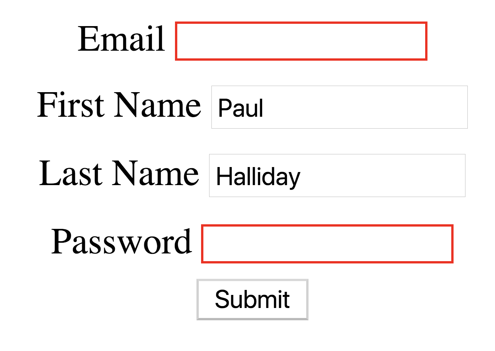
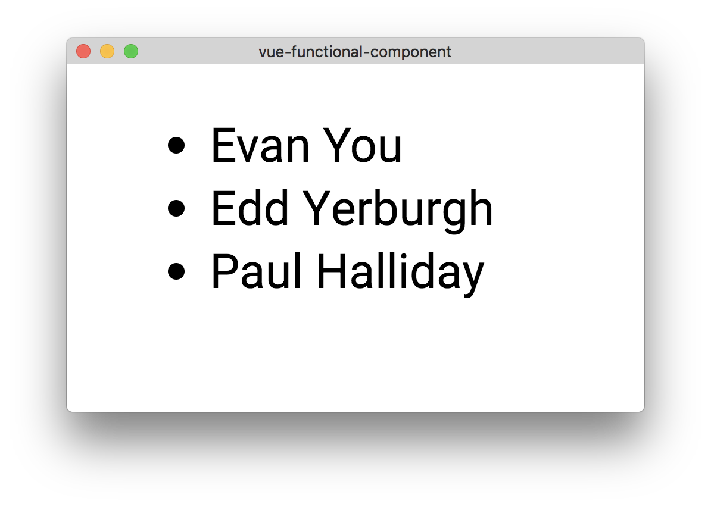

*******
创建更好的UI
*******
过渡和动画是在我们的应用程序中创造更好用户体验的好方法。由于有很多不同的选项和用例，如果使用不当或过度使用，它们可能会造成或破坏应用程序的感觉。本章将进一步讨论这个概念。

我们还将使用名为 ``Vuelidate`` 的第三方库查看表单验证。这将允许我们创建可随应用程序大小扩展的表单。我们还将获得根据表单状态更改用户界面的能力，以及显示有用的验证消息以帮助用户。

最后，我们将看看在 ``Vue`` 中如何使用渲染函数和 ``JSX`` 组合用户界面。虽然这并不适用于所有场景，但有时您希望在模板中充分利用 ``JavaScript`` ，并且可以使用功能组件模型创建智能/表示组件。

到本章结束时，您将拥有：

- 学习 ``CSS`` 动画；
- 创建您自己的 ``CSS`` 动画；
- 使用 ``Animate.css`` 只需少量工作创建交互式用户界面；
- 调查并创建您自己的 ``Vue`` 过渡；
- 在 ``Vue`` 中利用 ``Vuelidate`` 验证表单；
- 将 ``render`` 函数用作模板驱动用户界面的替代方法；
- 使用 ``JSX`` 编写与 ``React`` 类似的 ``UI`` ；

让我们首先了解为什么我们应该关心我们项目中的动画和过渡。

动画
====
动画可用于将焦点吸引到特定的 ``UI`` 元素，并通过将其带入生活来改善用户的整体体验。 当没有清晰的开始状态和结束状态时，应该使用动画。 动画可以设置为自动播放，也可以通过用户交互触发。

CSS动画
--------
CSS动画不仅是一个强大的工具，而且它们也很容易维护，只需很少的知识就可以在项目中使用它们。

将它们添加到界面可以是捕捉用户注意力的直观方法，也可以用于轻松地将用户指向特定元素。 动画可以定制，使其成为各种项目中大量用例的理想选择。

在深入研究 ``Vue`` 过渡和其他动画能力之前，我们应该了解如何执行基本的 ``CSS3`` 动画。 我们来创建一个简单的项目，更详细地看这个：

.. code-block:: shell

    # Create a new Vue project
    $ vue init webpack-simple vue-css-animations

    # Navigate to directory
    $ cd vue-css-animations

    # Install dependencies
    $ npm install

    # Run application
    $ npm run dev

在 ``App.vue`` 中，我们可以首先创建以下样式：

.. code-block:: css

    

正如你所看到的，没有什么不寻常的。 我们用 ``@keyframes`` 声明了一个名为 ``fade`` 的 ``CSS`` 动画，基本上给了 ``CSS`` 两个我们希望我们的元素处于不透明状态的状态 - ``opacity: 1`` 和 ``opacity: 0`` 。它没有说明这些关键帧多久或是否重复; 这一切都是在 ``animated`` 类上完成的。 无论何时将类添加到元素，我们将 ``fade`` 关键帧执行1秒; 同时，我们添加 ``opacity: 1`` 以确保在动画结束后它不会消失。

我们可以利用 ``v-bind:class`` 来动态添加/删除类，具体取决于 ``toggle`` 的值：

.. code-block:: html

    <template>
        

            <h1 v-bind:class="{ animated: toggle }">I fade in!</h1>
            <button @click="toggle = !toggle">Toggle Heading</button>
        

    </template>

    

我们现在可以根据 ``Boolean`` 淡入标题。 但是如果我们能做得更好呢？ 在这种特殊情况下，我们可以使用一种过渡来实现类似的效果。 在更详细地查看过渡之前，让我们看看我们可以在项目中使用 ``CSS`` 动画的其他方式。

Animate.CSS
^^^^^^^^^^^
``Animate.css`` 是将不同类型的动画轻松实现到您的项目中的好方法。它是由 ``Daniel Eden`` (https://daneden.me/) 创建的开源 ``CSS`` 库，它使我们可以访问“即插即用” ``CSS`` 动画。

在将其添加到任何项目之前，请转到 https://daneden.github.io/animate.css/ 并预览不同的动画样式。 有很多不同的动画可供选择，每个动画都提供了不同的默认动画。 这些可以进一步定制，我们稍后会在本节详细讨论。

继续在我们的终端中运行以下项目，创建一个游乐场项目：

.. code-block:: shell

    # Create a new Vue project
    $ vue init webpack-simple vue-animate-css

    # Navigate to directory
    $ cd vue-animate-css

    # Install dependencies
    $ npm install

    # Run application
    $ npm run dev

一旦项目设置完毕后，请在您选择的编辑器中打开并转到 ``index.html`` 文件。 在 ``<head>`` 标签内添加以下样式表：

.. code-block:: html

    <link rel="stylesheet" href="https://cdnjs.cloudflare.com/ajax/libs/animate.css/3.5.2/animate.min.css">

这是对项目所需的样式表 ``Animate.css`` 引用。

使用Animate.css
"""""""""""""""
现在我们在项目中有了 ``Animate.css`` ，我们可以将我们的 ``App.vue`` 更改为具有以下内容的模板：

.. code-block:: html

    <template>
        <h1 class="animated fadeIn">Hello Vue!</h1>
    </template>

在添加任何动画之前，我们首先需要添加 ``animated`` 类。 接下来，我们可以从 ``Animate.css`` 库中选择任何动画；我们在这个例子中选择了 ``fadeIn`` 。 然后可以将其切换为其他动画，如 ``bounceInLeft`` ， ``shake`` ， ``rubberBand`` 等等！

我们可以采用我们之前的例子，并将其转化为基于布尔值的绑定类值 - 但过渡可能更令人兴奋。

过渡
====
过渡的工作方式是在一个特定的状态下开始，然后过渡到另一个状态并插入中间的值。 过渡不能在动画中包含多个步骤。 设想一对窗帘从打开到关闭：第一个状态是开放位置，第二个状态是关闭位置。

``Vue`` 有自己的标签来处理过渡，称为 ``<transition>`` 和 ``<transition-group>`` 。 这些标签是可定制的，可以很容易地与 ``JavaScript`` 和 ``CSS`` 一起使用。不一定需要 ``transition`` 标签才能使过渡工作，因为您只需将状态变量绑定到可见属性，但标签通常会提供更多的控制权并可能带来更好的结果。

我们来看看之前的 ``toggle`` 示例，并创建一个使用 ``transition`` 的版本：

.. code-block:: html

    <template>
        

            <transition name="fadeIn"
                        enter-active-class="animated fadeIn"
                        leave-active-class="animated fadeOut">
                <h1 v-if="toggle">I fade in and out!</h1>
            </transition>
            <button @click="toggle = !toggle">Toggle Heading</button>
        

    </template>

    

我们使用 ``<transition>`` 标记围绕嵌套的元素，每当 ``<h1>`` 进入 ``DOM`` 时， ``enter-active-class`` 应用 ``animated fadeIn`` 。 这是由 ``v-if`` 指令触发的，因为 ``toggle`` 变量初始设置为 ``false`` 。 点击按钮切换我们布尔值，触发过渡并应用相应的 ``CSS`` 类。

过渡状态
--------
每次进入/离开过渡中最多可应用六个类，这些过渡类由进入场景，过程中以及离开场景组成。 设置一个（ ``v-enter-*`` ）表示最初进入然后移出的转换，而设置两个（ ``v-leave-*`` ）表示结束转换进入然后移出：

+----------------+---------------------------------------------------------------------------------------------------------------------------------------------------------------------+
| 名称           | 描述                                                                                                                                                                |
+================+=====================================================================================================================================================================+
| v-enter        | 定义进入过渡的开始状态。在元素被插入之前生效，在元素被插入之后的下一帧移除。                                                                                        |
+----------------+---------------------------------------------------------------------------------------------------------------------------------------------------------------------+
| v-enter-active | 定义进入过渡生效时的状态。在整个进入过渡的阶段中应用，在元素被插入之前生效，在过渡/动画完成之后移除。这个类可以被用来定义进入过渡的过程时间，延迟和曲线函数。       |
+----------------+---------------------------------------------------------------------------------------------------------------------------------------------------------------------+
| v-enter-to     | 2.1.8版及以上 定义进入过渡的结束状态。在元素被插入之后下一帧生效 (与此同时 v-enter 被移除)，在过渡/动画完成之后移除。                                               |
+----------------+---------------------------------------------------------------------------------------------------------------------------------------------------------------------+
| v-leave        | 定义离开过渡的开始状态。在离开过渡被触发时立刻生效，下一帧被移除。                                                                                                  |
+----------------+---------------------------------------------------------------------------------------------------------------------------------------------------------------------+
| v-leave-active | 定义离开过渡生效时的状态。在整个离开过渡的阶段中应用，在离开过渡被触发时立刻生效，在过渡/动画完成之后移除。这个类可以被用来定义离开过渡的过程时间，延迟和曲线函数。 |
+----------------+---------------------------------------------------------------------------------------------------------------------------------------------------------------------+
| v-leave-to     | 2.1.8版及以上 定义离开过渡的结束状态。在离开过渡被触发之后下一帧生效 (与此同时 v-leave 被删除)，在过渡/动画完成之后移除。                                           |
+----------------+---------------------------------------------------------------------------------------------------------------------------------------------------------------------+

每个进入和离开过渡都有一个前缀，该前缀在表中显示为 ``v`` 的默认值，因为过渡本身没有名称。 将输入或离开过渡添加到项目中时，理想情况下适当的命名约定应适用于充当唯一标识符。 如果您打算在项目中使用多个过渡，并且可以通过简单的赋值操作完成，这可以提供帮助：

.. code-block:: html

    <transition name="my-transition">

表单验证
========
在整本书中，我们已经看到了各种不同的方式，我们可以通过类似 ``v-mode`` 来捕获用户输入。我们将使用名为 ``Vuelidate`` 的第三方库根据特定的规则集进行模型验证。 让我们通过在终端中运行以下内容来创建一个游乐场项目：

.. code-block:: shell

    # Create a new Vue project
    $ vue init webpack-simple vue-validation

    # Navigate to directory
    $ cd vue-validation

    # Install dependencies
    $ npm install

    # Install Vuelidate
    $ npm install vuelidate

    # Run application
    $ npm run dev

什么是Vuelidate
---------------
``Vuelidate`` 是一个开源的轻量级库，可帮助我们用各种验证上下文执行模型验证。 验证可以在功能上进行组合，并且与其他库（如 ``Moment`` ， ``Vuex`` 等）也可以很好地协作。 由于我们已经使用 ``npm install vuelidate`` 将其安装到了我们的项目中，我们现在需要在 ``main.js`` 中将其注册为插件：

.. code-block:: js

    import Vue from 'vue';
    import Vuelidate from 'vuelidate';
    import App from './App.vue';

    Vue.use(Vuelidate);

    new Vue({
      el: '#app',
      validations: {},
      render: h => h(App),
    });

将空验证对象添加到我们的主 ``Vue`` 实例，可在整个项目中启动 ``Vuelidate`` 的 ``$v`` 。 这样，我们就可以使用 ``$v`` 对象来获取有关我们的 ``Vue`` 实例中所有组件的 ``Vue`` 实例中表单当前状态的信息。

使用Vuelidate
-------------
让我们创建一个基本表单，允许我们输入 ``firstName`` ， ``lastName`` ， ``email`` 和 ``password`` 。 这将允许我们在 ``Vuelidate`` 中添加验证规则并在屏幕上将其可视化：

.. code-block:: html

    <template>
        

            <form class="form" @submit.prevent="onSubmit">
                

                    <label for="email">Email</label>
                    <input
                            type="email"
                            id="email"
                            v-model.trim="email">
                

                

                    <label for="firstName">First Name</label>
                    <input
                            type="text"
                            id="firstName"
                            v-model.trim="firstName">
                

                

                    <label for="lastName">Last Name</label>
                    <input
                            type="text"
                            id="lastName"
                            v-model.trim="lastName">
                

                

                    <label for="password">Password</label>
                    <input
                            type="password"
                            id="password"
                            v-model.trim="password">
                

                <button type="submit">Submit</button>
            </form>
        

    </template>
    

这里有很多事情要做，所以让我们一步一步分解：

1. 我们使用 ``\@submit.prevent`` 指令创建一个新表单，以便在提交表单时不会重新加载页面，这与在此表单上调用提交并调用事件的 ``preventDefault`` 一样；
2. 接下来，我们将 ``v-model.trim`` 添加到每个表单输入元素，以便修剪任何空白字符并将输入捕获为变量；
3. 我们在数据函数中定义了这些变量，以便它们是反应性的；
4. 提交按钮被定义为 ``type="submit"`` ，以便当它被点击时，表单的提交功能被运行；
5. 我们正在创建一个空白的 ``onSubmit`` 函数，我们很快就会创建它；

现在，我们需要添加 ``@input`` 事件，并在每个输入元素上调用 ``touch`` 事件，绑定到数据属性 ``v-model`` ，并为字段提供验证，如下所示：

.. code-block:: html

    

        <label for="email">Email</label>
        <input
                type="email"
                id="email"
                @input="$v.email.$touch()"
                v-model.trim="email">
    

    

        <label for="firstName">First Name</label>
        <input
                type="text"
                id="firstName"
                v-model.trim="firstName"
                @input="$v.firstName.$touch()">
    

    

        <label for="lastName">Last Name</label>
        <input
                type="text"
                id="lastName"
                v-model.trim="lastName"
                @input="$v.lastName.$touch()">
    

    

        <label for="password">Password</label>
        <input
                type="password"
                id="password"
                v-model.trim="password"
                @input="$v.password.$touch()">
    

然后，我们可以通过从 ``Vuelidate`` 中导入验证并添加与表单元素相对应的验证对象，将 ``Validations`` 添加到我们的 ``Vue`` 实例中。

``Vuelidate`` 将使用我们的 ``data`` 变量同的名称来绑定验证规则，如下所示：

.. code-block:: js

    import { required, email } from 'vuelidate/lib/validators';

    export default {
     // Omitted
      validations: {
        email: {
          required,
          email,
        },
        firstName: {
          required,
        },
        lastName: {
          required,
        },
        password: {
          required,
        }
      },
    }

我们只需导入必须的电子邮件验证器并将其应用于每个模型项目。 这基本上确保我们所有的项目都是必需的，并且电子邮件输入与电子邮件正则表达式匹配。 然后，我们可以通过添加以下内容来查看表单和每个字段的当前状态：

.. code-block:: html

    

        <pre>{{$v}}</pre>
     

然后，我们可以添加一些样式来显示右侧的验证和左侧的表单：

.. code-block:: css

    

显示表单错误
^^^^^^^^^^^^
我们可以在 ``$v.model_name`` 对象（其中 ``model_name`` 等于 ``email`` ， ``firstName`` ， ``lastName`` 或 ``password`` ）中使用 ``$invalid`` 布尔值来显示消息或更改我们的表单字段的外观。 首先添加一个名为 ``error`` 的新类，添加一个红色边框包围输入字段：

.. code-block:: css

    

然后，只要输入字段无效，就可以有条件地使用 ``v-bind:class`` ：

.. code-block:: html

    

        <label for="email">Email</label>
        <input
                :class="{ error: $v.email.$error }"
                type="email"
                id="email"
                @input="$v.email.$touch()"
                v-model.trim="email">
    

    

        <label for="firstName">First Name</label>
        <input
                :class="{ error: $v.firstName.$error }"
                type="text"
                id="firstName"
                v-model.trim="firstName"
                @input="$v.firstName.$touch()">
    

    

        <label for="lastName">Last Name</label>
        <input
                :class="{ error: $v.lastName.$error}"
                type="text"
                id="lastName"
                v-model.trim="lastName"
                @input="$v.lastName.$touch()">
    

    

        <label for="password">Password</label>
        <input
                :class="{ error: $v.password.$error }"
                type="password"
                id="password"
                v-model.trim="password"
                @input="$v.password.$touch()">
    

当该字段无效或有效，这会给我们以下结果：

随后，如果是这种情况，我们可以显示一条错误消息。 这可以根据您想要显示的消息类型以多种方式完成。 我们以 ``email`` 输入为例，并在 ``email`` 字段的电子邮件地址无效时显示错误消息：

.. code-block:: html

    

        <label for="email">Email</label>
        <input
                :class="{ error: $v.email.$error }"
                type="email"
                id="email"
                @input="$v.email.$touch()"
                v-model.trim="email">

        
Please enter a valid email address

    

    // Omitted
    

正如我们从 ``$v`` 对象的表示中看到的那样，当字段有一个有效的电子邮件地址时， ``email`` 布尔值为 ``true`` ，如果不是，则为 ``false`` 。 虽然这会检查电子邮件是否正确，但不会检查该字段是否为空。 让我们添加另一个错误消息，该消息根据 ``required`` 验证器来检查它：

.. code-block:: html

    
Please enter a valid email address.

    
Email must not be empty.

如果我们想要，我们甚至可以更进一步，创建我们自己的包装器组件，它将渲染每个字段的各种错误消息。 让我们填写我们的错误消息的其余部分，并检查表单元素是否已被触发（是 ``$dirty`` ）：

.. code-block:: html

    

        <label for="email">Email</label>
        <input
                :class="{ error: $v.email.$error }"
                type="email"
                id="email"
                @input="$v.email.$touch()"
                v-model.trim="email">

        

            
Please enter a valid email address.

            
Email must not be empty.

        

    

    

        <label for="firstName">First Name</label>
        <input
                :class="{ error: $v.firstName.$error }"
                type="text"
                id="firstName"
                v-model.trim="firstName"
                @input="$v.firstName.$touch()">

        

            
First Name must not be empty.

        

    

    

        <label for="lastName">Last Name</label>
        <input
                :class="{ error: $v.lastName.$error}"
                type="text"
                id="lastName"
                v-model.trim="lastName"
                @input="$v.lastName.$touch()">

        

            
Last Name must not be empty.

        

    

    

        <label for="password">Password</label>
        <input
                :class="{ error: $v.password.$error }"
                type="password"
                id="password"
                v-model.trim="password"
                @input="$v.password.$touch()">

        

            
Password must not be empty.

        

    

密码验证
^^^^^^^^
在创建用户帐户时，密码通常会输入两次并且符合最小长度。 让我们添加另一个字段和一些更多的验证规则来执行此操作：

.. code-block:: js

    import { required, email, minLength, sameAs } from 'vuelidate/lib/validators';

    export default {
        // Omitted
        data() {
            return {
                email: '',
                password: '',
                repeatPassword: '',
                firstName: '',
                lastName: '',
            };
        },
        validations: {
            email: {
                required,
                email,
            },
            firstName: {
                required,
            },
            lastName: {
                required,
            },
            password: {
                required,
                minLength: minLength(6),
            },
            repeatPassword: {
                required,
                minLength: minLength(6),
                sameAsPassword: sameAs('password'),
            },
        },
    }

我们已经完成了以下工作：

1. 将 ``repeatPassword`` 字段添加到我们的数据对象，以便它可以保存重复的密码；
2. 从 ``Vuelidate`` 导入 ``minLength`` 和 ``sameAs`` 验证器；
3. 向 ``password`` 验证器添加了6个字符的 ``minLength`` ；
4. 添加 ``sameAs`` 验证程序以强制执行 ``repeatPassword`` 应遵循与 ``password`` 相同的验证规则的事实；

由于我们现在有适当的密码验证，我们可以添加新的字段并显示任何错误消息：

.. code-block:: html

    

        <label for="email">Email</label>
        <input
                :class="{ error: $v.email.$error }"
                type="email"
                id="email"
                @input="$v.email.$touch()"
                v-model.trim="email">

        

            
Please enter a valid email address.

            
Email must not be empty.

        

    

    

        <label for="firstName">First Name</label>
        <input
                :class="{ error: $v.firstName.$error }"
                type="text"
                id="firstName"
                v-model.trim="firstName"
                @input="$v.firstName.$touch()">

        

            
First Name must not be empty.

        

    

    

        <label for="lastName">Last Name</label>
        <input
                :class="{ error: $v.lastName.$error}"
                type="text"
                id="lastName"
                v-model.trim="lastName"
                @input="$v.lastName.$touch()">

        

            
Last Name must not be empty.

        

    

    

        <label for="password">Password</label>
        <input
                :class="{ error: $v.password.$error }"
                type="password"
                id="password"
                v-model.trim="password"
                @input="$v.password.$touch()">

        

            
Password must not be empty.

        

    

    

        <label for="repeatPassword">Repeat Password</label>
        <input
                :class="{ error: $v.repeatPassword.$error }"
                type="password"
                id="repeatPassword"
                v-model.trim="repeatPassword"
                @input="$v.repeatPassword.$touch()">

        

            
Passwords must be identical.

            
Password must not be empty.

        

    

表单提交
^^^^^^^^
接下来，如果表单无效，我们可以禁用我们的 ``Submit`` 按钮：

.. code-block:: html

    <button :disabled="$v.$invalid" type="submit">Submit</button>

我们也可以通过 ``this.$v.$invalid`` 来获得这个值。 以下是我们如何检查表单是否无效，然后根据表单元素创建用户对象的示例：

.. code-block:: js

    methods: {
        onSubmit() {
            if(!this.$v.$invalid) {
                const user = {
                    email: this.email,
                    firstName: this.firstName,
                    lastName: this.lastName,
                    password: this.password,
                    repeatPassword: this.repeatPassword
                }

                // Submit the object to an API of sorts
            }
        },
    },

如果你想以这种方式使用你的数据，你可能更喜欢这样设置你的数据对象：

.. code-block:: js

    data() {
        return {
            user: {
                email: '',
                password: '',
                repeatPassword: '',
                firstName: '',
                lastName: '',
            }
        };
    },

我们现在已经创建了一个适当的验证表单！

渲染/功能组件
=============
我们将绕过验证和动画，考虑使用功能组件和渲染函数来提高应用程序性能。 您也可能会听到这些被称为“表示组件” ，因为它们是无状态的，只能接收数据作为输入 ``prop`` 。

到目前为止，我们只使用 ``template`` 标签声明了组件的标记，但也可以使用 ``render`` 函数（如 ``src/main.js`` 中所示）：

.. code-block:: js

    import Vue from 'vue'
    import App from './App.vue'

    new Vue({
      el: '#app',
      render: h => h(App)
    })

``h`` 来自于 ``hyperscript`` ，它允许我们使用 ``JavaScript`` 创建/描述 ``DOM`` 节点。 在渲染函数中，我们只是渲染 ``App`` 组件，将来我们会更详细地讨论这个。 ``Vue`` 创建了一个虚拟 ``DOM`` ，使得比使用实际的 ``DOM`` 更简单（以及在处理大量元素时提高性能）。

渲染元素
--------
我们可以用下面的对象代替我们的 ``App.vue`` 组件，它需要一个 ``render`` 对象和 ``hyperscript`` 而不是使用 ``template`` ：

.. code-block:: js

    

然后这将渲染一个带有 ``'Hello render!'`` 文本节点的新 ``h1`` 标签。 然后这被称为 ``VNode`` （虚拟节点）和多个描述整个树的 ``VNodes`` （虚拟 ``DOM`` 节点）。 现在让我们看看如何在 ``ul`` 中显示项目列表：

.. code-block:: js

    render(h){
        h('ul', [
            h('li', 'Evan You'),
            h('li', 'Edd Yerburgh'),
            h('li', 'Paul Halliday')
        ])
    }

认识到我们只能用 ``hyperscript`` 渲染一个根节点是很重要的。 这个限制对于我们的模板是一样的，所以我们期望我们将项目包装在 ``div`` 中，如下所示：

.. code-block:: js

    render(h) {
        return h('div', [
            h('ul', [
                h('li', 'Evan You'),
                h('li', 'Edd Yerburgh'),
                h('li', 'Paul Halliday')
            ])
        ])
    }

属性
^^^^
我们还可以将样式元素和各种其他属性传递给我们渲染的项目。 以下是使用样式对象将每个项目的颜色更改为红色的示例：

.. code-block:: js

    h('div', [
        h('ul', { style: { color: 'red' } }, [
            h('li', 'Evan You'),
            h('li', 'Edd Yerburgh'),
            h('li', 'Paul Halliday')
        ])
    ])

正如你想象的，我们可以添加尽可能多的样式属性，以及我们期望的额外选项，例如 ``props`` ,  ``directives`` , ``on`` （点击处理程序）等等。 让我们看看我们如何使用 ``props`` 映射元素来渲染一个组件。

组件和props
^^^^^^^^^^^
让我们使用一个 ``prop`` 在 ``components/ListItem.vue`` 下创建一个名为 ``ListItem`` 的组件。 我们将渲染此组件来代替我们的 ``li`` ，并映射包含各种 ``names`` 的数组。 注意我们为何为 ``Vue`` 实例添加 ``functional: true`` 选项； 这告诉 ``Vue`` ，这纯粹是一个表示组件，它不会有任何状态：

.. code-block:: js

    

使用我们的 ``render`` 函数，``h`` 通常也被引用为 ``createElement`` ，并且因为我们处于 ``JavaScript`` 上下文中，所以我们可以利用数组运算符（如 ``map`` ， ``filter`` ， ``reduce`` 等）。 让我们用 ``map`` 动态生成组件的静态名称：

.. code-block:: js

    import ListItem from './components/ListItem.vue';

    export default {
        data() {
            return {
                names: ['Evan You', 'Edd Yerburgh', 'Paul Halliday']
            }
        },
        render(createElement) {
            return createElement('div', [
                createElement('ul',
                    this.names.map(name =>
                        createElement(ListItem,
                            {props: { name: name } })
                    ))
            ])
        }
    }

我们需要做的最后一件事是为我们的组件添加一个 ``render`` 函数。 作为第二个参数，我们可以访问上下文对象，这使我们可以访问诸如 ``props`` 之类的选项。 在这个例子中，我们假定 ``name`` ``prop`` 总是存在的，并且不是 ``null`` 或 ``undefined`` ：

.. code-block:: js

    export default {
        props: ['name'],
        functional: true,
        render(createElement, context) {
            return createElement('li', context.props.name)
        }
    }

我们现在有一个元素列表，其中包含作为 ``prop`` 传递的项：

.. image:: ./images/8-3.png

JSX
^^^^
虽然这是一个伟大的思想实践，但是在大多数情况下，模板更具优越性 有时候你想在组件内部使用渲染函数，在这种情况下，使用 ``JSX`` 可能会更简单。

通过在我们的终端中运行以下代码，将 ``JSX`` 的 ``babel`` 插件添加到我们的项目中：

.. code-block:: shell

    $ npm i -D babel-helper-vue-jsx-merge-props babel-plugin-syntax-jsx babel-plugin-transform-vue-jsx

然后，我们可以更新我们的 ``.babelrc`` 以使用新的插件：

.. code-block:: json

    {
      "presets": [
        ["env", { "modules": false }],
        "stage-3"
      ],
      "plugins": ["transform-vue-jsx"]
    }

这允许我们重写我们的渲染函数以利用更简单的语法：

.. code-block:: js

    render(h) {
        return (
            

                <ul>
                    { this.names.map(name => <ListItem name={name} />) }
                </ul>
            

        )
    }

这更具说明性，也更容易维护。 在引擎盖下，它正在通过 ``Babel`` 转录成以前的 ``hyperscript`` 格式。

总结
====
在本章中，我们学习了如何利用 ``Vue`` 项目中的 ``CSS`` 动画和过渡。 这使我们能够使用户体验更加流畅，并改善应用程序的外观和感觉。

我们还了解了如何使用渲染方法构建 ``UI`` ；这涉及到使用 ``HyperScript`` 创建 ``VNodes`` ，然后使用 ``JSX`` 进行更简洁的抽象。 虽然您可能不想在项目中使用 ``JSX`` ，但如果您使用过 ``React`` ，则可能会觉得更舒服。
