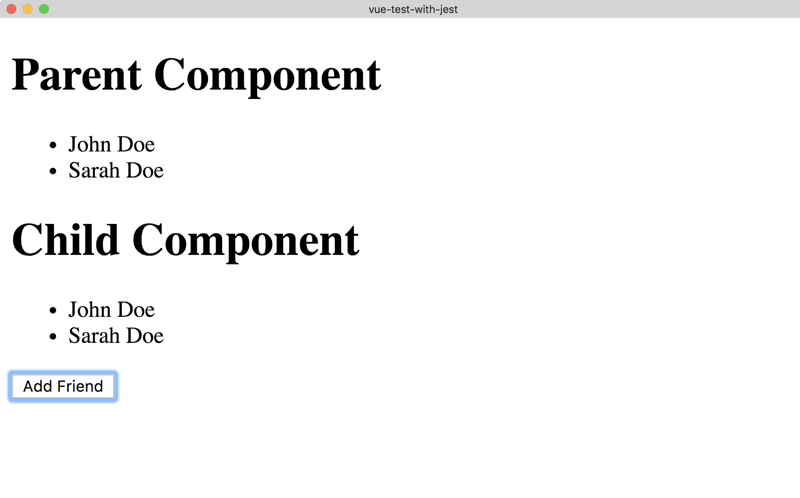
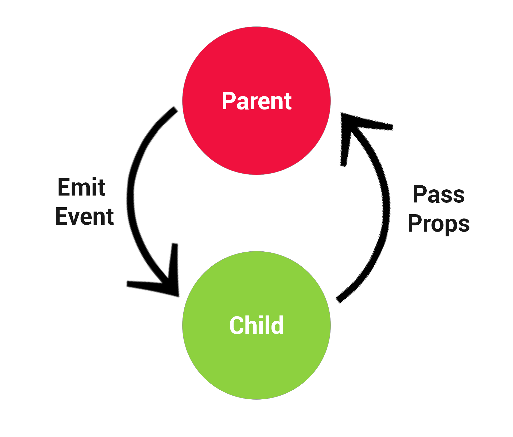
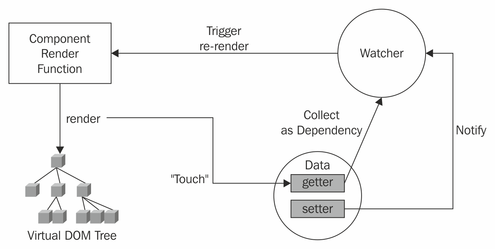
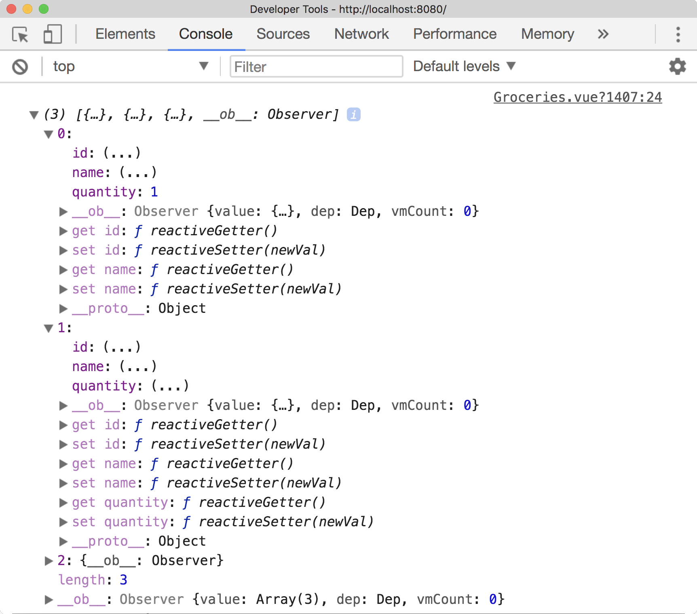
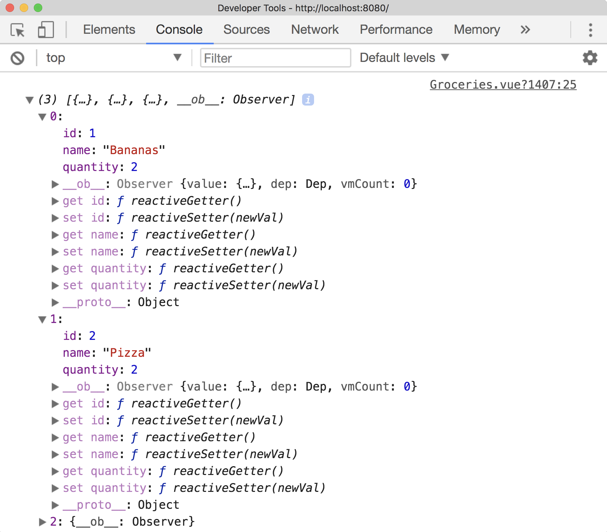

****
模式
****
在本章中，我们将研究 ``Vue.js`` 中的各种反模式，并在本书中学习高层次的概念。我们将研究各种模式和反模式，以及我们如何编写在团队和自己的项目中保持一致的代码。

在将任何事物定义为模式或反模式之前，为读者准确定义两者非常重要。如果某件事情被认为是一种模式，这意味着这是绝大多数情况下的推荐做法。相反，如果我将其定义为反模式，那么在绝大多数情况下，这很可能不是推荐的做法。有关这方面的更多信息，可以在 https://github.com/pablohpsilva/vuejs-component-style-guide 找到一个很好的模式和指南。

软件开发是一个有多种方式来解决同一问题的意见领域，所以可能有意识形态被归类为你不同意的东西，这没关系。在一天结束时，每个团队都有自己的风格，但开发人员应该努力坚持减少摩擦并尽可能加快开发的模式。

在本章中，我们将学习以下主题：

- ``Vue`` 项目中的常见模式和反模式；
- 容器/演示组件；
- 如何编写可测试的 ``Vue.js`` 组件；

组件
====
组件在 ``Vue`` 中进行通信的方式很多，例如使用 ``props`` ，事件和基于 ``store`` 的场景。 ``Vue`` 还使我们能够访问 ``$parent`` 和 ``$children`` 对象，这使我们可以与父/子组件进行交互。我们来看看这个，看看为什么它不应该被使用。

通讯-反模式
-----------
想象一下，我们有我们熟悉的 ``TodoList`` 示例，并且在 ``TodoItem`` 组件中，我们希望能够完成特定的 ``Todo`` 。如果我们想把我们的待办事项保留在 ``TodoList`` 中，并从 ``TodoItem`` 中调用完成的方法，我们可以这样做：

.. code-block:: js

    export default {
      props: ['todo'],
      methods: {
        completeTodo(todo) {
          this.$parent.$options.methods.completeTodo(todo);
        }
      }
    }

由于很多原因，这是一个糟糕的主意，主要是因为我们将这两个组件紧密耦合在一起，并假设父组件上始终存在完整的 ``Todo`` 方法。

我们可以改变这一点，让它变得更好？
^^^^^^^^^^^^^^^^^^^^^^^^^^^^^^^^^^
我并不是说父母/孩子的组件不能沟通，但你应该设法以灵活的方式设计组件。根据应用程序的结构使用事件或 ``Vuex`` 存储。下面是一个使用事件的例子：

.. code-block:: js

    methods: {
      completeTodo(todo) {
        this.$emit('completeTodo', todo)
      }
    }

Children mutating props – Anti-pattern
---------------------------------------
重要的是我们不能修改子组件中的 ``props`` 。当传递给组件时， ``props`` 应该被视为真实的来源，因此，从子组件内改变值通常是不好的做法。有一些独特的案例场景可能适合这样做，例如使用 ``.sync`` 修改器实现双向数据绑定。

如果我们使用前面的示例并从孩子内部更改 ``todos prop`` ，我们会在控制台内收到警告：

.. code-block:: js

    methods: {
      completeTodo(todo) {
        this.todo = [{id: 1, name: 'Do the dishes.'}];
        this.$emit('completeTodo', todo)
      }
    }

我们应该做什么呢
^^^^^^^^^^^^^^^^
如果要使用子组件内的 ``prop`` ，最好将 ``prop`` 保存为 ``data`` 选项内的新变量。然后这允许您改变该组件本地的新版本 ``prop`` ：

.. code-block:: js

    export default {
      props: {
        age: {
          type: Number,
        }
      },
      data() {
        return {
          personAge: this.age
        }
      },
    }

然后，我们可以访问并更改 ``personAge`` ，而不用担心任何副作用。在创建可筛选搜索框时可以看到另一个示例，其中不是直接对 ``prop`` 进行更改，而是使用计算属性执行所需的功能：

.. code-block:: js

    export default {
      props: {
        filter: {
          type: String,
        }
      },
      computed: {
        trimFilter() {
          return this.filter.trim().toLowerCase()
        }
      }
    }

Mutating property arrays
^^^^^^^^^^^^^^^^^^^^^^^^
在 ``JavaScript`` 中传递数组和对象作为属性时，需要考虑的一个重要因素是它们通过引用传递。这意味着对子数组中原始数组的任何更改也会溢出到父组件中。让我们看看这个再行动：

.. code-block:: html

    <template>
      

        <h1>Parent Component</h1>
        <ul>
          <li v-for="friend in friendList" :key="friend.id">{{friend.name}}</li>
        </ul>

        <Person :friendList="friendList" />
      

    </template>

    

在这里，我们有一个组件（ ``App.vue`` ），它包含一个我们在屏幕上显示并传递给子组件的数组。我们将在子组件内的屏幕上显示相同的数组，但也给孩子一个按钮来将新项添加到数组中：

.. code-block:: html

    <template>
      

        <h1>Child Component</h1>
        <ul>
          <li v-for="friend in friendList" :key="friend.id">{{friend.name}}</li>
        </ul>
        <button @click="addFriend">Add Friend</button>
      

    </template>

    

当我们添加一个新的 ``person`` 到我们的朋友的列表时，下面是我们的结果：

然后，这两个组件都有相同的数组！这不是我们想要的。如果由于某种原因，我们想要采取这样的行动，保留一份朋友的名单并改变这一点会更明智一些，如下所示：

.. code-block:: js

    export default {
      props: {
        friendList: {
          type: Array,
        }
      },
      data() {
        return {
          fList: [...this.friendList]
        }
      },
      methods: {
        addFriend() {
          this.fList.push({ id: 2, name: 'Sarah Doe' })
        }
      }
    }

使用数据作为对象-反模式
-----------------------
使用 ``Vue`` 创建组件时，重要的是 ``data`` 选项是一个返回保存数据的新对象的函数，而不仅仅是一个普通的数据对象。

如果您只是使用不是函数的数据对象，则组件的所有实例将共享相同的数据。这很糟糕，因为正如您可以想象的那样，组件的所有实例在任何时候都会随着相同的数据更新。确保每个组件都能够管理自己的数据而不是在整个板上共享数据非常重要。

我们来看看这个问题：

.. code-block:: js

    data: {
        recipeList: [],
        selectedCategory: 'Desserts'
    }

我们可以通过这样做来解决这个问题：

.. code-block:: js

    data () {
        return {
            recipeList: [],
            selectedCategory: 'Desserts'
        }
    }

通过创建 ``return`` 语句，它允许创建的每个实例都拥有自己的对象而不是共享的对象。这样就可以使代码多次使用而不会产生共享数据的冲突。接下来，让我们来看看命名我们的组件的最佳实践。

命名组件-反模式
---------------
用单个单词命名组件并不是一个好主意，因为它有机会与原生 ``HTML`` 元素发生冲突。假设我们有一个注册表单和一个名为 ``Form.vue`` 的组件；在我们的模板中使用这个名称时什么是合适的名称？那么，正如你可能想象的那样，有一个名为 ``<form>`` 的组件会与 ``<form>`` 冲突，所以最好使用多个单词命名的组件。更好的示例可以是 ``signup-form`` ， ``app-signup-form`` ， ``app-form`` ，具体取决于喜好：

.. code-block:: js

    // This would not be an appropriate name as it conflicts with HTML elements.
    Vue.component('form', Form)

    // This is a better name as it's multi-word and there are less chances to conflict.
    Vue.component('signup-form', Form)

模板表达式
----------
通常，当我们在屏幕上显示项目时，我们可能需要计算值和调用函数来改变数据的外观。不要在模板内部完成这项工作，建议将它移入 ``computed`` 属性中，因为这更容易维护：

.. code-block:: js

    // Bad
    <nuxt-link :to="`/categories/${this.category.id}`" class="card-footer-item">View</nuxt-link>

    // Good
    <nuxt-link :to="categoryLink" class="card-footer-item">View</nuxt-link>

    export default {
      props: ['category'],
      computed: {
        categoryLink () {
          return `/categories/${this.category.id}`
        }
      }
    }

这意味着模板中的任何更改都更容易处理，因为输出映射到计算属性。

模式-容器/展示组件
------------------
组件设计的一个重要部分是确保您的组件是可测试的。您应该将每个组件视为应用程序中的独立模块，并根据需要将其切换为输入/输出；因此，它不应该与另一个组件紧密耦合。

最好的方式是确保组件可测试，通过具有定义良好的公共 ``API`` 确保轻耦合，通过组件 ``props`` 和事件在父/子组件之间进行通信来实现。这也可以帮助我们进行测试，因为我们可以更轻松地模拟组件。

遵循此模型时使用的常见模式是容器/表示组件。这意味着我们将所有业务逻辑和状态保留在“容器”中，然后将状态传递给“演示”组件以显示在屏幕上。

演示组件仍然可以与其他组件进行通信，如果有必要，可以使用事件，但它不应修改或保持入站 ``props`` 外的状态。这确保了我们的组件之间有一个共同的数据流，这意味着我们的应用程序更容易推理。

这里有一个明确命名的组件—— ``DogContainer.vue`` ：

.. code-block:: html

    <template>
      <dog-presentational :dogName="dogName" @woof="woof"></dog-presentational>
    </template>

    

容器组件将狗的名字（以及任何其他项）作为属性传递给了展示组件。容器组件也在这个组件上监听一个名为 ``woof`` 的事件，并在它发出时调用 ``woof`` 方法来采取行动。这是我们的展示组件：

.. code-block:: js

    <template>
      

        <h1>Name: {{dogName}}</h1>
        <button @click="woof">Woof</button>
      

    </template>

    

我们的组成部分的关注现在明显分开了，我们之间有明确的沟通渠道。

该组件的可视化图如下：

Prop验证
--------
虽然我们应该通过 ``props`` 寻求子组件之间的沟通，但在考虑类型，要求，默认等等时验证属性时，请务必仔细。在整本书中，为了简洁起见，我使用了两种技术的混合体，但在生产中， ``props`` 应该经过适当的验证。我们先看一些属性类型的例子：

.. code-block:: js

    export default {
      props: {
        firstName: {
          type: String
        },
        lastName: {
          type: String
        },
        age: {
          type: Number
        },
        friendList: {
          type: Array
        }
      },
    }

我们还有各种其他类型可用，如布尔函数，函数或任何其他构造函数（即 ``Person`` 类型）。通过准确定义我们期望的类型，这可以让我们（和我们的团队）更好地理解我们在该组件中可以期待的内容。

同时，我们也可以确保 ``props`` 是必需的。这应该在必要时完成，使我们能够确保无论何时使用该组件，都不会丢失所需的 ``props`` ：

.. code-block:: js

    props: {
        firstName: {
            type: String,
                required: true,
        default: 'John'
        },
        lastName: {
            type: String,
                required: true,
        default: 'Doe'
        }
    }

我们应该总是设法在可能的情况下给予我们的道具默认值，因为这样可以减少必要的配置，但如果开发人员需要，仍然可以对组件进行定制。 **在处理对象和数组时，函数被用作默认参数以避免实例共享相同值的问题。**

.. code-block:: js

    props: {
      firstName: {
        type: String,
        default: 'John'
      },
      lastName: {
        type: String,
        default: 'Doe'
      },
      friendList: {
        type: Array,
        default: () => [{ id: 1, name: 'Paul Halliday'}]
      }
    }

我们也可以为我们的属性分配一个自定义 ``validator`` 函数。假设我们有一个 ``machine`` 组件，只在用户年满18岁时才会渲染：

.. code-block:: js

    props: {
        age: {
            type: Number,
                required: true,
                validator: value => {
                return value >= 18
        },
    }

了解反应性
----------
我们已经讨论过反应性以及如何在前面的章节中使用它，但重新考虑很重要。当我们在 ``Vue`` 中创建反应性数据对象时，它会为每个属性使用 ``Object.defineProperty`` 添加适当的获取器/设置器。这允许 ``Vue`` 处理对对象的更改并通知观察者，随后更新组件 https://vuejs.org/v2/guide/reactivity.html 。流程的可视化图像如下：

这意味着数据选项中定义的任何属性都是自动响应的。下面是一个例子：

.. code-block:: js

    export default {
      data() {
        return {
          name: 'Vue.js'
        }
      }
    }

``name`` 属性在这个 ``Vue`` 实例内是反应性的，但是如果我们要在 ``Vue`` 实例之外添加另一个属性，这不是反应性的。我们来看一个例子：

.. code-block:: js

    export default {
      data() {
        return {
          items: [
            { id: 1, name: 'Bananas'},
            { id: 2, name: 'Pizza', quantity: 2},
            { id: 3, name: 'Cheesecake', quantity: 5}
          ]
        }
      },
    }

我们的 ``groceries`` 组件有一个包含各种对象的数组。每个对象都有一个数量，除了香蕉对象，但我们希望为它设置数量。当使用 ``v-for`` 时，包含 ``v-bind:key`` （或简写 ``:key`` ）是很重要的，因为它充当每个项目的唯一标识符，这样做可以重用和重新排序每个节点。虽然 ``key`` 可能是 ``v-for`` 的一个属性，但请记住它有其他用例场景。

.. code-block:: js

    <template>
      

        <ul>
          <li v-for="(item, index) in items" :key="item.id" @click="addQuantity(index)">
            {{item.name}} {{item.quantity}}
          </li>
        </ul>
      

    </template>

    <script>
    export default {
      data() {
        return {
          items: [
            { id: 1, name: 'Bananas'},
            { id: 2, name: 'Pizza', quantity: 2},
            { id: 3, name: 'Cheesecake', quantity: 5}
          ]
        }
      },
      methods: {
        addQuantity(selected) {
          this.items[selected].quantity = 1;
          console.log(this.items);
        }
      }
    }

如果我们回到浏览器，并继续使用开发工具来访问控制台，我们可以看到数量已被设置为为我们的对象保存一个值。

请注意，在数据对象内部定义的包含数量属性的对象时，会为数量属性定义反应性的 ``getters/setters`` 。在此之后向对象添加属性意味着 ``Vue`` 不会添加适当的 ``getters/setters`` 。如果我们想要这样做，我们必须改用 ``Vue.set`` ：

.. code-block:: js

    methods: {
      addQuantity(selected) {
        const selectedItem = this.items[selected];
        this.$set(selectedItem, 'quantity', 2)
        console.log(this.items);
      }
    }

这一次，我们的实例中每个属性都有 ``getter/setter`` ：

总结
====
在本章中，我们研究了反模式和模式，扩展了我们的知识，不仅仅是它们是什么，而且还将它们用于适合最佳实践。不仅如此，我们还回顾了我们在本书中学到的很多概念，并考虑了一些新的想法和技术，以便我们可以继续使用。

反思前面的章节，我们可以回头看看我们已经覆盖了多少基础。本书所涵盖的技术将允许您使用 ``Vue.js`` 创建可扩展的应用程序，并根据您学到的知识进行构建。要记住的另一件重要的事情是， ``Web`` 开发总是在不断发展， ``Vue`` 的实际应用程序数量不断增长。

