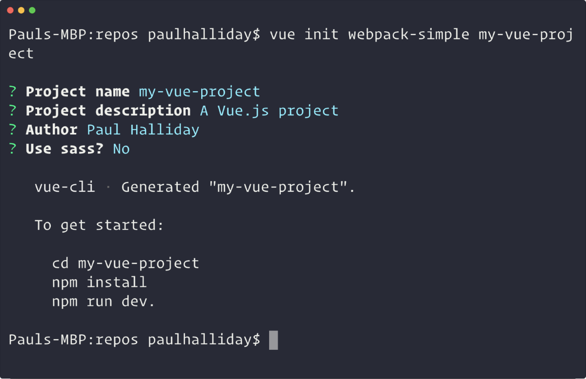
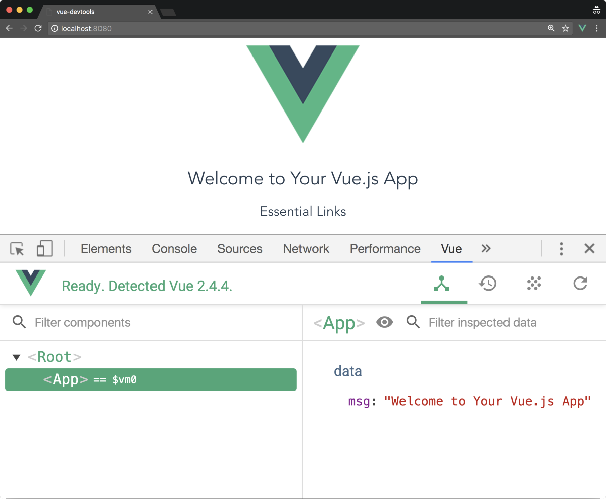
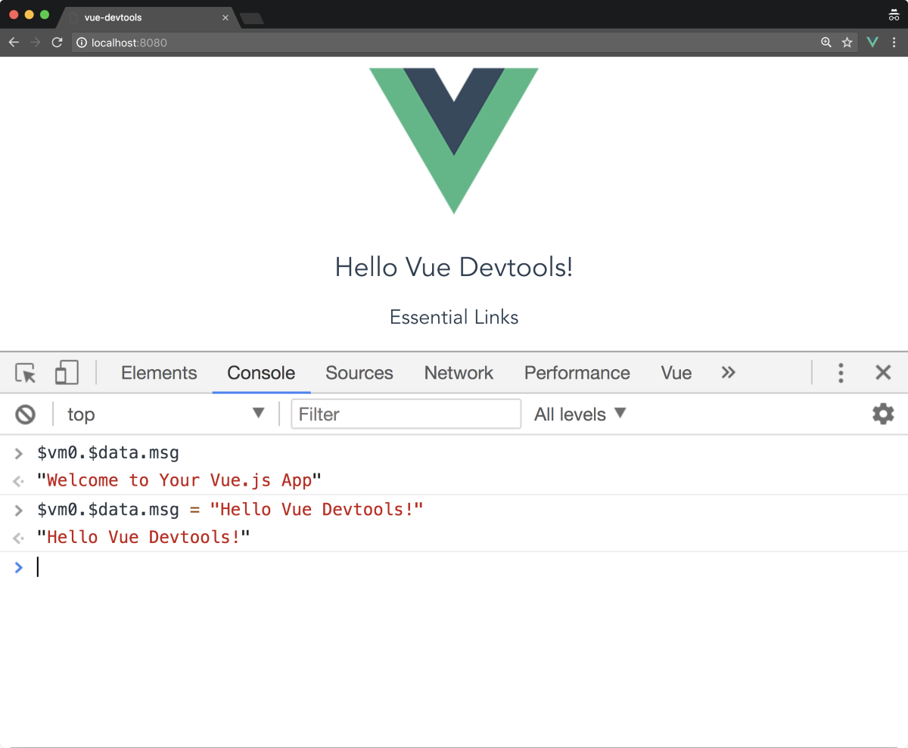
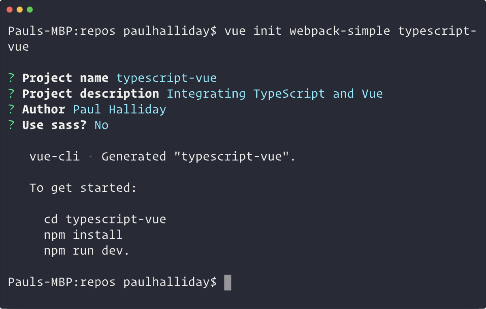
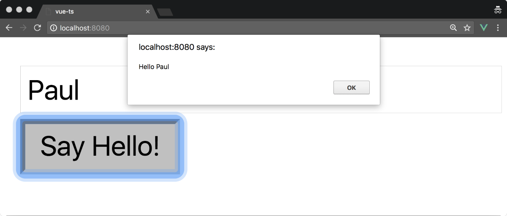
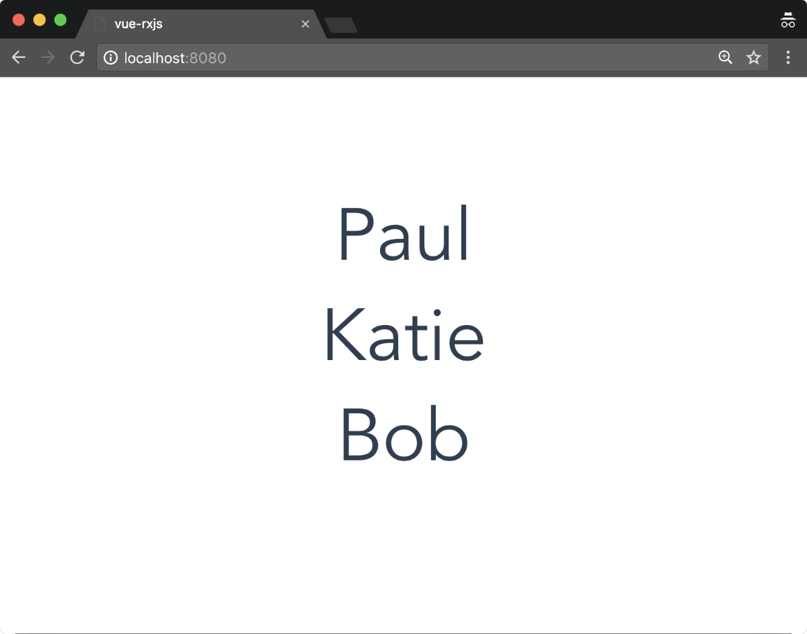

*********
正确创建Vue项目
*********
在本章中，我们将研究如何创建可维护的 ``Vue`` 项目，并利用许多工具和可用的模式。 如果您目前没有在开发工作流程中最大限度地利用这些内容，您可能会发现我们在本章中讨论的大多数概念都适用于其他技术。

在本章中，我们将看到以下内容：

- Vue devtools；
- Visual Studio代码扩展；
- TypeScript集成；
- 使用RxJS的反应性；

Visual Studio Code扩展
=====================
我们的开发环境是应用程序开发的重要组成部分。 使用 ``Visual Studio Code`` 创建 ``Vue`` 应用程序时，建议使用以下扩展名：

- Vetur；
- Vue 2 Snippets；

让我们更详细地看看这两个。

Vetur
-----
``Vetur`` 由 ``Vue Language Server`` 提供支持，为我们提供语法高亮， ``Emmet`` （用于增加 ``HTML/CSS`` 工作流程），片段， ``linting`` ， ``IntelliSense`` 等等。 这极大地改善了我们的开发体验，并得到了广泛的支持， ``GitHub`` 上有超过1,000颗星。 要安装扩展，请单击 ``Visual Studio Code``中的扩展图标并键入 ``Vetur`` ; 从这里开始，您可以选择安装，它将自动在整个项目中使用。

Vue 2 Snippets
--------------
片段是应用程序开发的重要组成部分; 与 ``Emmet`` 类似，它们使我们能够在我们的应用程序中快速搭建通用模式。 我们还将安装另一个 ``Visual Studio Code`` 扩展，它为我们提供了各种常用的片段，名为 ``Vue 2 Snippets`` 。

这使我们可以节省大量的时间，否则我们不得不花费时间写出相同的样板代码。 以下面的例子; 虽然它本质上是简单的，但是我们得到了片段的描述，并且随着 ``Tab`` 的点击，它扩展到我们预定义的代码。

Vue CLI
=======
``Vue`` 命令行界面（ ``CLI`` ）使我们能够利用各种不同的模板选项快速搭建新的 ``Vue``项目。 目前，可用的模板选项包括诸如 ``Webpack`` ， ``Browserify`` 和 ``Progressive Web Application`` 等功能。

当然，我们可以创建自己的 ``Vue`` 应用程序并手动添加诸如 ``Webpack`` 之类的工具，但这会产生技术开销，因为我们必须学习，构建和维护配置。 ``Vue CLI`` 为我们做了这些工作，同时保留了一组选定的官方模板，但不会限制我们修改生成的 ``Webpack`` 配置。 所有这些都使我们能够生成新的 ``Vue`` 项目。

要开始使用 ``Vue CLI`` ，让我们确保已经安装了它：

.. code-block:: shell

    npm install vue-cli -g

然后，我们可以使用 ``Vue init`` 命令来使用 ``Webpack`` 模板构建一个新的 ``Vue`` 项目：

.. code-block:: shell

    vue init webpack-simple my-vue-project

在输入前面的命令后，我们应该得到如下所示的终端：

如果我们将其分解，我们基本上是基于名为 ``my-vue-project`` 的 ``webpack-simple`` 模板初始化一个新的 ``Vue`` 项目。 然后我们导航到一个向导过程，要求我们获取更多有关我们项目的元数据。 此元数据和配置将根据您选择的模板而有所不同。

让我们来研究模板创建的文件和文件夹：

+-------------------+-----------------------------------------------------+
| 文件/文件夹       | 描述                                                |
+===================+=====================================================+
| src/              | 该文件夹包含所有项目代码。我们将花费大量时间在src中 |
+-------------------+-----------------------------------------------------+
| .bablrc           | 这是Babel配置文件，它允许我们写ES2015并将其妥善编译 |
+-------------------+-----------------------------------------------------+
| index.html        | 这是默认HTML文件                                    |
+-------------------+-----------------------------------------------------+
| package.json      | 它包含我们依赖和其它具体项目的元数据                |
+-------------------+-----------------------------------------------------+
| webpack.config.js | 我们Webpack配置文件，允许我们使用 .vue文件，Babel等 |
+-------------------+-----------------------------------------------------+

注意我们不再使用 ``.js`` 文件，现在我们的 ``src`` 目录中有 ``.vue`` 文件。 一个 ``Vue`` 文件被称为单个文件组件，它有一个模板，脚本和样式标签，允许我们只将范围的一部分限制到这个组件。

这可能是由于我们使用 ``Webpack`` 模板原因，因此我们有一个自定义的“加载器”。 这个怎么用？ 在研究这个之前，我们先快速回顾一下现代 ``JavaScript`` 构建系统。

JavaScript模块
---------------
为了创建可重用的模块化代码，我们的目标应该是在大多数情况下每个功能都有一个文件。 这让我们避免了可怕的 ``Spaghetti code``反模式，在这种模式下我们有很强的耦合性和很少的关注点分离。 继续面向面食主题，解决方案是采用更容易使用的更小，松散耦合，分布式模块的 ``Ravioli code`` 模式。 ``JavaScript`` 模块的外观是什么？

在 ``ECMAScript2015`` 中，模块只是一个使用 ``export`` 关键字的简单文件，并允许其他模块导入该功能块：

.. code-block:: js

    // my-module.js
    export default function add(x, y) {
     return x + y
    }

然后我们可以从另一个模块导入 add：

.. code-block:: js

    // my-other-module.js
    import { add } from './my-other-module'

    add(1, 2) // 3

由于浏览器尚未完全兼容模块导入，我们经常使用工具来协助捆绑过程。 这个领域的常见项目有 ``Babel`` ， ``Bublé`` ， ``Webpack`` 和 ``Browserify`` 。 当我们使用 ``Webpack`` 模板创建一个新项目时，它使用 ``Vue-loader`` 将我们的 ``Vue`` 组件转换为标准的 ``JavaScript`` 模块。

Vue-loader
^^^^^^^^^^
在我们的标准 ``webpack-simple`` 模板的 ``./webpack-config.js`` 内部，我们有一个模块对象，它允许我们设置我们的加载器; 这告诉 ``Webpack`` 我们希望它在我们的项目中使用 ``.vue`` 文件：

.. code-block:: js

    module: {
     rules: [{
      test: /\.vue$/,
      loader: 'vue-loader',
      options: {
       loaders: {}
      // other vue-loader options go here
     }
    }]

为此， ``Webpack`` 运行一个正则表达式来匹配任何与 ``.vue`` 相匹配的东西，然后将它传递给我们的 ``vue-loader`` 以转换为普通的 ``JavaScript`` 模块。 在这个简单的例子中，我们使用 ``.vue`` 扩展名加载文件，但 ``vue-loader`` 可以进一步自定义，您可能希望进一步查看(https://goo.gl/4snNfD)。 我们当然可以自己做这个配置，但是希望你能看到使用 ``Vue CLI`` 生成我们的 ``Webpack`` 项目的好处。

不用Webpack加载模块
-------------------
虽然 ``Webpack`` 可以帮助我们以更多的方式加载模块，但我们现在可以在浏览器中本地加载 ``JavaScript`` 模块。 它往往比捆绑工具更糟糕（在撰写本文时），但这可能会随着时间而改变。

为了演示这一点，让我们来看看终端，并根据简单的模板制作一个简单的计数器。 这个模板有效地启动了一个新的 ``Vue`` 项目，没有任何捆绑工具：

.. code-block:: shell

    # New Vue Project
    vue init simple vue-modules

    # Navigate to Directory
    cd vue-modules

    # Create App and Counter file
    touch app.js
    touch counter.js

然后，我们可以编辑我们的 ``index.html`` 来添加来自 ``type ="module"`` 的脚本文件，这使我们可以使用之前概述的导出/导入语法：

.. code-block:: html

    <!-- index.html -->
    <!DOCTYPE html>
    <html>
    <head>
     <title>Vue.js Modules - Counter</title>
     
    </head>
    <body>
         

         
         
    </body>
    </html>

警告：确保您的浏览器是最新的，以便前面的代码可以成功运行。

然后，在我们的 ``counter.js`` 里面，我们可以导出一个新的 ``default`` 对象，它作为一个新的 ``Vue`` 实例。 它充当一个简单的计数器，允许我们增加或减少一个值：

.. code-block:: js

    export default {
     template: `
      

       <h1>Counter: {{counter}}</h1>
       <button @click="increment">Increment</button>
       <button @click="decrement">Decrement</button>
      
`,
     data() {
      return {
       counter: 1
      };
     },
     methods: {
      increment() {
       this.counter++;
      },
      decrement() {
       this.counter--;
      }
     }
    };

然后我们可以在 ``app.js`` 中导入 ``counter.js`` 文件，从而演示我们可以导入/导出模块的方式。 为了让我们的计数器显示在我们的根 ``Vue`` 实例中，我们将计数器注册为此实例内的组件，并将模板设置为 ``<counter></counter>`` ，即组件的名称，就是组件文件名称：

.. code-block:: js

    import Counter from './counter.js';

    const app = new Vue({
      el: '#app',
      components: {
       Counter
      },
      template: `<counter></counter>`
    });

我们将在本书的后续章节中更详细地讨论这一点，但您现在需要知道的是，它实际上充当另一个 ``Vue`` 实例。 当我们在实例中注册组件时，我们只能从该实例访问该组件。

在下一节中，我们将深入研究调试我们的 ``Vue`` 应用程序，以及 ``Vue devtools`` 在其中扮演的角色。

VueJs开发工具
==============
能够准确调试我们的应用程序是我们开发工作流程的重要组成部分。 在前一章中，我们安装了 ``VueJS devtools`` ，我们将在本节中更详细地使用它。 我们来做一个游乐场项目：

.. code-block:: shell

    # New project
    vue init webpack-simple vue-devtools

    # Change directory
    cd vue-devtools

    # Install dependencies
    npm install

    # Run application
    npm run dev

然后，我们可以打开我们的开发人员控制台并导航到 ``Vue`` 选项卡。 当我们从组件列表中选择 ``App`` 时，我们可以看到这个组件的数据对象和其他信息。 默认情况下，我们有我们在模板中绑定的 ``msg`` 变量，我们可以在我们的开发人员工具中看到这个变量：

但是这两种方式都可以使用 - 我们可以用 ``$vm0.$data.msg`` 访问这个 ``Vue`` 实例内的对象。 也可以在控制台中查看此内容，选择 ``<Root>`` 然后 ``<App>`` 将在控制台中显示 ``msg`` ;。 我们可以改变这个值，当 ``Vue`` 监控这个值时，它会自动在屏幕上改变：

注意我们的信息是如何变成 ``Hello Vue Devtools！`` 的; 如果我们有多个 ``Vue`` 实例，则会有 ``Vue`` 的其他前缀版本如 ``$vm1`` ， ``$vm2`` 等等。 在本书的后面，当我们使用 ``Vuex`` 时，我们会经常使用它。 接下来，我们来看看如何将 ``TypeScript`` 整合到我们的 ``Vue`` 项目中。 这对于那些有 ``Angular`` 背景的人或任何希望利用静态类型的人都很有用。

TypeScript和Vue
===============
您以前可能使用过 ``TypeScript`` ，或者您可能会好奇在 ``Vue`` 项目中如何利用 ``TypeScript`` 提供的额外工具。为什么要使用 ``TypeScript`` ？ Gao等人最近的一项研究发现， ``TypeScript/static`` 打字工具将犯下的错误减少了 ``15％`` (https://goo.gl/XUTPf4)。

如果你以前使用过 ``Angular`` ，那么这个语法应该让你感觉很自在，因为我们将使用装饰器和 ``ES2015`` 类。 让我们来研究如何将 ``TypeScript`` 添加到使用 ``Vue CLI`` 构建的项目中：

.. code-block:: shell

    # Create a new Vue project
    vue init webpack-simple typescript-vue

    # Change directory
    cd typescript-vue

    # Install dependencies
    npm install

您应该在终端上获得以下输出：

如果我们导航到我们的项目目录并按照说明运行 ``npm install`` ，那么我们需要安装 ``TypeScript`` 加载器并编辑我们的 ``Webpack`` 配置。 这允许我们在项目内部加载 ``.ts`` 文件，并且因为我们已经使用了 ``webpack-simple`` 模板，所以就像安装加载器并进行一些更改一样简单。 同时，我们也可以将 ``TypeScript`` 安装到项目中：

.. code-block:: shell

    # Install TypeScript and the TypeScript Loader
    npm install typescript ts-loader --save-dev

然后，我们需要对 ``Webpack`` 配置进行一些更改以添加新的加载器。 热模块更换默认情况下处于启用状态，因此无需刷新以查看加载后的任何更改。

请记住从命令行运行该项目，然后键入 ``npm dev`` 。

我们需要将我们的入口点改为 ``main.ts`` （并随后重命名它），并定义 ``ts-loader`` 并删除 ``babel-loader`` ，然后编辑 ``webpack.config.js`` 文件，粘贴以下内容：

.. code-block:: js

    var path = require('path');
    var webpack = require('webpack');

    module.exports = {
        entry: './src/main.ts',
        output: {
            path: path.resolve(__dirname, './dist'),
            publicPath: '/dist/',
            filename: 'build.js'
        },
        module: {
            rules: [
                {
                    test: /\.vue$/,
                    loader: 'vue-loader',
                    options: {
                        loaders: {}
                    }
                },
                {
                    test: /\.tsx?$/,
                    loader: 'ts-loader',
                    exclude: /node_modules/,
                    options: {
                        appendTsSuffixTo: [/\.vue$/]
                    }
                },
                {
                    test: /\.(png|jpg|gif|svg)$/,
                    loader: 'file-loader',
                    options: {
                        name: '[name].[ext]?[hash]'
                    }
                }
            ]
        },
        resolve: {
            extensions: ['.ts', '.js', '.vue'],
            alias: {
                vue$: 'vue/dist/vue.esm.js'
            }
        },
        devServer: {
            historyApiFallback: true,
            noInfo: true
        },
        performance: {
            hints: false
        },
        devtool: '#eval-source-map'
    };

    if (process.env.NODE_ENV === 'production') {
        module.exports.devtool = '#source-map';
        // http://vue-loader.vuejs.org/en/workflow/production.html
        module.exports.plugins = (module.exports.plugins || []).concat([
            new webpack.DefinePlugin({
                'process.env': {
                    NODE_ENV: '"production"'
                }
            }),
            new webpack.optimize.UglifyJsPlugin({
                sourceMap: true,
                compress: {
                    warnings: false
                }
            }),
            new webpack.LoaderOptionsPlugin({
                minimize: true
            })
        ]);
    }

之后，我们可以在我们的项目根目录中创建一个 ``tsconfig.json`` ，它负责适当地配置我们的 ``TypeScript`` 设置：

.. code-block:: json

{
  "compilerOptions": {
    "lib": ["dom", "es5", "es2015"],
    "module": "es2015",
    "target": "es5",
    "moduleResolution": "node",
    "experimentalDecorators": true,
    "sourceMap": true,
    "allowSyntheticDefaultImports": true,
    "strict": true,
    "noImplicitReturns": true
  },
  "include": ["./src/**/*"]
}

现在在我们的项目中设置了 ``TypeScript`` ，但为了在我们的 ``Vue`` 应用程序中真正利用这一点，我们还应该使用 ``vue-class-component`` 。 这使我们能够在组件属性上使用静态类型，并将组件定义为原生 ``JavaScript`` 类：

.. code-block:: shell

    # Install TypeScript helpers
    npm install vue-class-component --save-dev

然后我们可以通过首先将它指定为具有 ``lang = "ts"`` 属性的脚本来定义我们的 ``App.vue`` 文件。 然后我们可以像往常一样导入 ``Vue`` ，但是同样，我们也从 ``vue-class-component`` 中导入 ``Component`` 以用作此文件中的装饰器。 这允许我们将它指定为一个新的 ``Vue`` 组件，并且使用 ``Component`` 装饰器可以定义属性，模板等等。

在我们的组件装饰器里面，我们指定一个带有输入框和按钮的模板。 这个例子让我们看到我们如何绑定到类属性，以及从我们的类中调用方法。 以下代码应该替换 ``App.vue`` 文件中已有的代码：

.. code-block:: js

    

在运行上面的代码之后，你应该得到这样的东西：

生命周期钩子
------------
像 ``created()`` ， ``mounted()`` ， ``destroy()`` 等生命周期钩子可以被定义为类中的函数。

- created() ： 这允许在将组件添加到 ``DOM`` 之前对组件执行动作。 使用这个钩子可以访问数据和事件。
- mounted() : 可以在渲染之前以及渲染后访问组件。 它提供了与 ``DOM`` 和组件进行交互的完全访问权限。
- destroyed() : 所有附加在组件上的东西都被破坏了。 它允许从 ``DOM`` 中删除组件时清除组件。

不使用 ``TypeScript`` ，它们将被识别并按照预期的方式执行。 以下是使用 ``created`` 和 ``mounted`` 的挂钩的示例：

.. code-block:: js

    // Omitted
    export default class App extends Vue {
        name: string = 'Paul';

        created() {
            console.log(`Created: Hello ${this.name}`)
        }

        mounted() {
            console.log(`Mounted: Hello ${this.name}`);
        }
    }

Properties
----------
我们已经看到我们如何创建类并使用 ``Component`` 装饰器; 现在让我们来看看如何使用 ``vue-property-decorator`` 在我们的类中定义 ``props`` ：

.. code-block:: shell

    # Install Vue Property Decorator
    npm install vue-property-decorator --save-dev

这依赖 ``vue-class-component`` ，所以无论何时我们安装 ``vue-property-decorator`` ，你都需要确保 ``vue-class-component`` 也被安装。 接下来让我们使用 ``@Prop`` 装饰器定义一个 ``Component`` 属性：

.. code-block:: js

    

请注意我们现在如何从 ``vue-property-decorator`` 而不是 ``vue-class-component`` 导入组件。 这是因为它将其导出为我们导入的模块。 然后，我们用 ``name`` 键和 ``Paul Halliday`` 的默认值定义一个新的组件属性; 在使用 ``TypeScript`` 之前，它看起来如下所示：

.. code-block:: js

    export default {
        props: {
            name: {
                type: String,
                default: 'Paul Halliday'
            }
        }
    }

Computed
--------
计算属性允许传递多个表达式，并且 ``Vue`` 实例上的这些属性需要使用类 ``getter/setters`` 。 所以，如果我们想要检索我们名字的反转版本，我们可以简单地通过以下内容：

.. code-block:: js

    @Component({
        template: `
       

         <input type="text" v-model="name" />
         <button @click="sayHello(name)">Say Hello!</button>
         
{{nameReversed}}

       

     `
    })
    export default class App extends Vue {
        @Prop({ default: 'Paul Halliday' }) name: string;

        // Computed values
        get nameReversed() {
            return this.name.split("").reverse().join("");
        }

        sayHello(name: string): void {
            alert(`Hello ${name}`)
        }
    }

这相当于：

.. code-block:: js

    export default {
        computed: {
            nameReversed() {
                return this.name.split("").reverse().join("");
            }
        }
    }

其他装饰器可以使用，例如 ``@Watch`` ， ``@Inject`` ， ``@Model`` 和 ``@Provide`` 。 每个装饰器允许一致的实现，并为 ``Vue`` 实例提供类似的 ``API`` 。 在下一节中，我们将看看如何使用 ``RxJS`` 增强我们的 ``Vue`` 应用程序的反应性。

RxJS和Vue
=========
如果你来自 ``Angular`` 背景，至少 ``RxJS`` 的基本概念很可能会让你感到宾至如归。 这意味着我们通常会处理诸如观察对象，主体和各种操作符等事物。 如果你以前没有用过它们，别担心 - 我们将研究 ``RxJS`` 是什么，以及为什么我们想在 ``Vue`` 中使用它。

RxJS是什么
----------
如果我们看一下 ``RxJS`` 文档，我们会看到以下定义： ``ReactiveX`` 是一个通过使用可观察队列来编写异步和基于事件的程序的库 (http://reactivex.io/intro.html)。 乍看之下，这不是让我们感觉在我们的项目中使用它感觉很舒服的精确描述。

``RxJS`` 协助我们在应用程序内部使用响应式编程原则，通常被称为更具说明性的风格，而不是强制性的。 当我们谈论一种命令式编程风格时，我们通常会告诉计算机如何执行特定任务的确切步骤。 声明式风格使我们能够更多地关注预期结果而非实施。

在 ``JavaScript`` 中，我们可以使用以下方法创建一个事件流：

.. code-block:: js

    document.addEventListener('click', event => {
        console.log(event);
    });

这使我们能够观察 ``document`` 上的任何鼠标点击。 我们可以捕获诸如点击坐标，目标，事件类型等内容。 显然，这是一个异步的可观察数据流。 我们不知道什么时候有人要点击屏幕，我们也不在乎。 我们所做的只是观察并在事件发生时执行特定的操作。

我们可以使用 ``RxJS`` 采取这些相同的原则，并将其应用于我们现代应用程序，其中所有内容都是流。 我们可以有一个可观察的数据流，从 ``Facebook`` 反馈到文档点击事件，定时器等任何事情！ 一切都可以是一个流。

与Vue集成
^^^^^^^^^^
为了将 ``RxJS`` 与 ``Vue`` 集成，我们需要创建一个新的 ``Vue`` 项目并安装 ``RxJS`` 和 ``Vue-Rx`` 。 关于使用 ``Vue-Rx`` 插件的一个重要的事情是它由 ``Vue.js`` 团队正式支持，这让我们相信它将会得到长期的支持。

让我们用 ``Vue CLI`` 创建一个新项目，并集成 ``RxJS`` ：

.. code-block:: shell

    # New Vue project
    vue init webpack-simple vue-rxjs

    # Change directory
    cd vue-rxjs

    # Install dependencies
    npm install

    # Install rxjs and vue-rx
    npm install rxjs vue-rx

    # Run project
    npm run dev

我们现在需要告诉 ``Vue`` 我们想要使用 ``VueRx`` 插件。 这可以使用 ``Vue.use()`` 完成，并且不是特定于此实现的。 无论何时，我们希望为我们的 ``Vue`` 实例添加新的插件，调用 ``Vue.use()`` 会对插件的 ``install()`` 方法进行内部调用，从而在全局范围扩展新功能。 要编辑的文件将是我们的 ``main.js`` 文件，位于 ``src/main.js`` 。 本书后面的章节将更详细地讨论插件：

.. code-block:: js

    import Vue from "vue";
    import App from "./App.vue";
    import VueRx from "vue-rx";
    import Rx from "rxjs";

    // Use the VueRx plugin with the entire RxJS library
    Vue.use(VueRx, Rx);

    new Vue({
     el: "#app",
     render: h => h(App)
    });

注意前面实现的存在问题？ 那么，为了应用程序的性能和减少包的大小，我们只应该导入我们需要的东西。 这然后变成：

.. code-block:: js

    import Vue from "vue";
    import App from "./App.vue";
    import VueRx from "vue-rx";

    // Import only the necessary modules
    import { Observable } from "rxjs/Observable";
    import { Subject } from "rxjs/Subject";

    // Use only Observable and Subject. Add more if needed.
    Vue.use(VueRx, {
        Observable,
        Subject
    });

    new Vue({
        el: "#app",
        render: h => h(App)
    });

然后，我们可以在 ``Vue`` 应用程序中创建一个 ``Observable`` 数据流。 让我们进入 ``App.vue`` ，并从 ``RxJS`` 中导入必要的模块：

.. code-block:: js

    // Required to create an Observable stream
    import { Observable } from 'rxjs/Observable';
    import 'rxjs/add/observable/of';

然后我们可以创建一个新的 ``Observable`` 数据; 在这个例子中，我们将使用一组简单的人：

.. code-block:: js

    // New Observable stream of string array values
    const people$ = Observable.of(['Paul', 'Katie', 'Bob']);

这就允许我们从订阅对象中订阅这个 ``Observable`` 。 如果您以前曾经使用过 ``Angular`` ，那么这允许我们访问类似于异步管道的 ``Observable`` （并处理必要的取消订阅）：

.. code-block:: js

    export default {
      data () {
        return {
          msg: 'Welcome to Your Vue.js App'
        }
      },
      /**
       * Bind to Observable using the subscriptions object.
       * Allows us to then access the values of people$ inside of our template.
       * Similar to the Async pipe within Angular
       **/
      subscriptions: {
        people$
      }
    }

除此之外，如果我们想为每个组件创建一个 ``Observable`` 的新实例，我们可以声明我们的订阅作为一个函数：

.. code-block:: js

    subscriptions() {
        const people$ = Observable.of(['Paul', 'Katie', 'Bob'])
        return {
            people$
        }
    }

最后，我们可以在模板中显示 ``Observable`` 的结果。 我们可以使用 ``v-for`` 指令遍历数组并在屏幕上显示结果。 这个怎么用？ 使用以下示例， ``v-for`` 语法使用 ``item in items`` 语法，可以将其视为我们上下文中 ``person in people$`` 。 这允许我们使用插值绑定来访问我们的 ``people$`` ``Observable`` （或任何其他数组）中的每个项目：

.. code-block:: html

    <template>
      

        <ul>
          <li
            v-for="(person,index) in people$":key="index"> {{person}}
          </li>
        </ul>
      

    </template>

正如您在浏览器内部看到的那样，我们的三个项目现在已经出现在我们屏幕上的列表项目中：

总结
====
在本章中，我们研究了如何利用 ``Vue CLI`` 、适当的捆绑配置和 ``ES2015`` 支持来搭建新的 ``Vue`` 项目。我们已经看到，这不仅为我们提供了额外的力量，而且从长远来看也为我们节省了大量的时间。我们不必记住如何创建 ``Webpack`` 或 ``Babel`` 配置，因为这一切都是由初始模板处理的;但即使如此，如果我们想添加额外的配置选项，我们也可以。

然后，我们研究了如何使用 ``Webpack`` 和 ``ts-loader`` 实现 ``TypeScript`` ，以及如何利用常用 ``TypeScript`` 和 ``Vue`` 模式与属性装饰器（s）的优势。这使我们能够利用核心工具并帮助减少代码中的错误。

最后，我们还在我们的应用程序中实现了 ``RxJS`` 和 ``Vue-Rx`` ，以利用 ``Observable`` 模式。如果你有兴趣在你的项目中使用 ``RxJS`` ，这是未来集成的一个很好的起点。

在下一章中，我们将深入研究 ``Vue.js`` 实例和不同的保留属性，如 ``data`` ， ``computed`` ， ``ND watch`` ，以及创建 ``getter`` 和 ``setter`` 。本章特别考虑何时应该使用 ``computed`` 或 ``watch`` 属性。

