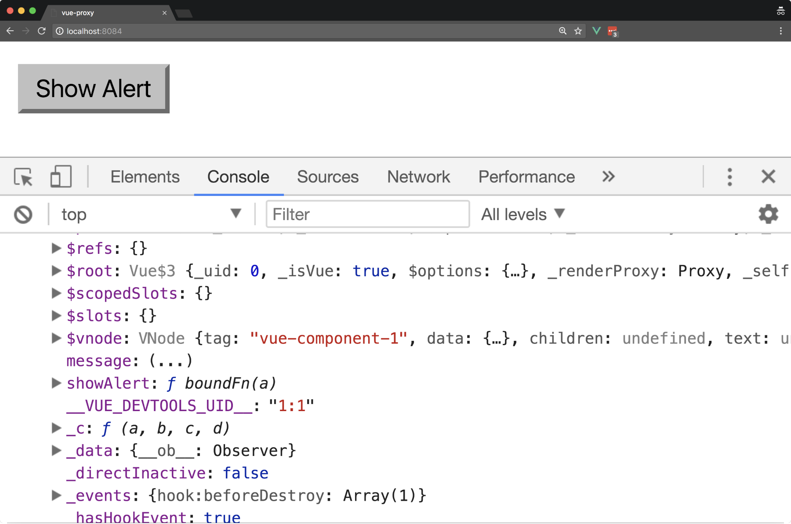
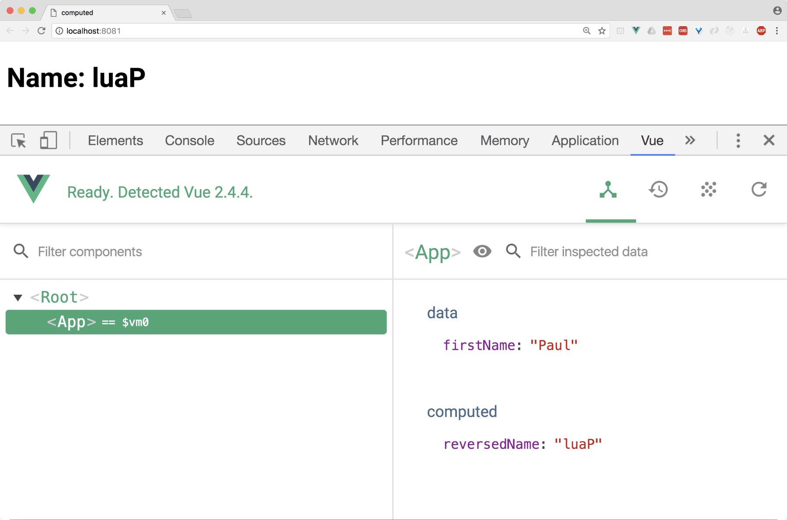
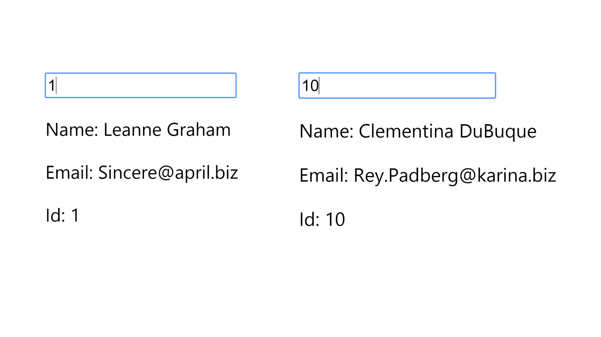
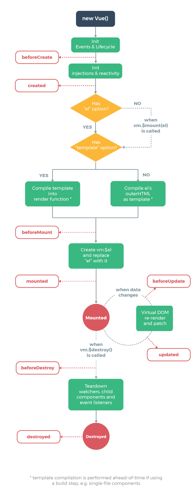
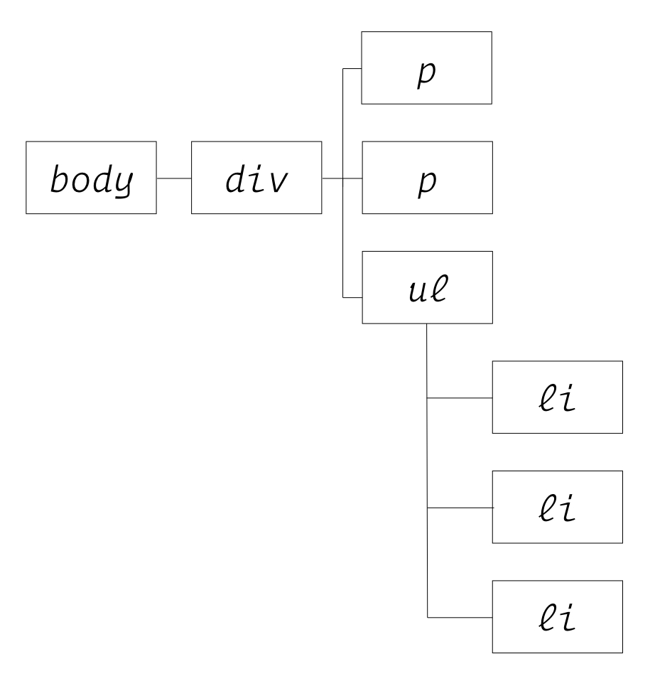
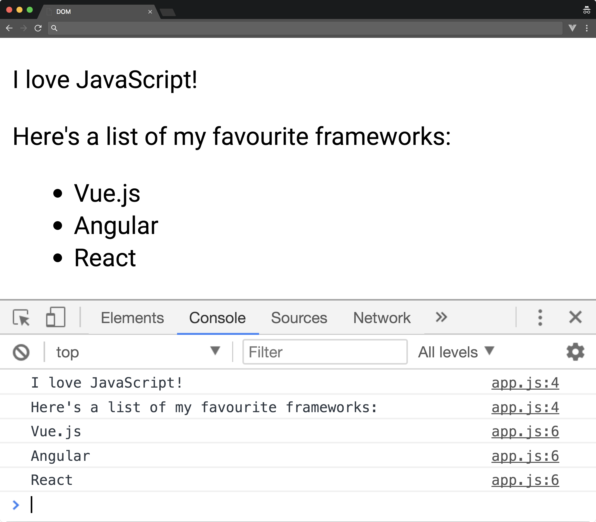

*************
用Vue编写清洁和精炼代码
*************
在本节中，我们将查看 ``Vue.js`` 实例底层如何工作。我们还将查看实例上的各种属性，如 ``data`` ， ``computed`` ， ``watch`` 以及使用每个属性时的最佳实践。此外，我们将查看 ``Vue`` 实例中可用的各种生命周期钩子，从而允许我们在应用程序的各个阶段调用特定函数。最后，我们将研究文档对象模型（ ``DOM`` ）以及为什么 ``Vue`` 实现虚拟 ``DOM`` 以提高性能。

在本章的最后，您将会：

- 对 ``JavaScript`` 中的关键字 ``this`` 工作方式有更深入的了解；
- 了解 ``Vue`` 如何在 ``Vue`` 实例中代理 ``this`` 关键字；
- 使用 ``data`` 属性来创建反应性绑定；
- 使用 ``computed`` 属性根据我们的数据模型创建声明性函数；
- 使用 ``watched`` 属性访问异步数据并建立 ``computed`` 属性的基础；
- 使用生命周期钩子来激活 ``Vue`` 生命周期特定阶段的功能；
- 研究 ``DOM`` 和虚拟 ``DOM`` ，了解 ``Vue`` 如何将数据渲染到屏幕上；

首先，让我们先看看这是如何在 ``JavaScript`` 内工作的，以及它如何与我们的 ``Vue`` 实例中的上下文相关。

代理
====
到目前为止，您可能已经与 ``Vue`` 应用程序进行了交互，并问自己： ``this`` 是如何工作的？ 在研究 ``Vue.js`` 如何处理 ``this`` 之前，让我们来看看它在 ``JavaScript`` 中的工作原理。

在JavaScript中this是怎么工作的
------------------------------
在 ``JavaScript`` 中， ``this`` 具有不同的上下文，范围从全局 ``window`` 上下文到 ``eval`` ， ``newable`` 和函数上下文。作为关系到全球范围默认上下文，就是我们的窗口对象：

.. code-block:: js

    /**
     * 全局上下文中将this值输出到的控制台，将返回Window对象
     */
    console.log(this);

    /**
     * 当引用全局Window对象时，我们不需要用this来引用它们，但是如果我们这样做，我们会得到相同的行为
     */
    alert('Alert one');
    this.alert('Alert two');

这个变化的上下文取决于我们所处的范围。 这意味着，如果我们有一个具有特定值的 ``Student`` 对象，例如 ``firstName`` ， ``lastName`` ， ``grades`` 等等，则 ``this`` 上下文将与该对象本身相关：

.. code-block:: js

    /**
     * 当我们进入另一个词法作用域时，这个变化的上下文发生变化，以我们的学生对象为例：
     *
     */
    const Student = {
        firstName: 'Paul',
        lastName: 'Halliday',
        grades: [50, 95, 70, 65, 35],
        getFullName() {
            return `${this.firstName} ${this.lastName}`
        },
        getGrades() {
            return this.grades.reduce((accumulator, grade) => accumulator + grade);
        },
        toString() {
            return `Student ${this.getFullName()} scored ${this.getGrades()}/500`;
        }
    }

当我们用 ``console.log(Student.toString())`` 运行前面的代码时，我们得到这个结果： ``Student Paul Halliday scored 315/500`` ，因为它的上下文现在被限定在对象本身而不是全局窗口范围内。

如果我们想在文档中显示它，我们可以这样做：

.. code-block:: js

    let res = document.createTextNode(Student.toString());
    let heading = document.createElement('h1');
    heading.appendChild(res);
    document.body.appendChild(heading);

请注意，使用前面的代码，我们再次不必使用 ``this`` ，因为在全局上下文不需要它。

现在我们已经理解了 ``this`` 是如何在基本层面上起作用的，我们可以研究 ``Vue`` 如何在实例内代理 ``this`` ，以便更轻松地与各种属性进行交互。

Vue如何处理this
----------------
您可能已经注意到，至此我们能够使用 ``this`` 语法在 ``data`` ，方法和其他对象内引用值，但实例的实际结构是 ``this.data.propertyName`` 或 ``this.methods.methodName`` ; 所有这些都是因为 ``Vue`` 代理我们的实例属性。

我们来看一个非常简单的具有一个实例的 ``Vue`` 应用程序。 我们有一个 ``data`` 对象，它有一个 ``message`` 变量和一个名为 ``showAlert`` 的方法;  ``Vue`` 如何知道通过 ``this.message`` 访问我们的警报文本？

.. code-block:: html

    <template>
     <button @click="showAlert">
     Show Alert</button>
    </template>

    

``Vue`` 将实例属性代理到顶层对象，从而允许我们通过 ``this`` 来访问这些属性。 如果我们要将实例记录到控制台（借助 ``Vue.js devtools`` ），我们会得到以下结果：

在前面的屏幕截图中查看的关键属性是 ``message`` 和 ``showAlert`` ，它们都是在我们的 ``Vue`` 实例上定义的，但在初始化时被代理到根对象实例。

Data属性
========
当我们向数据对象添加一个变量时，我们本质上会创建一个反应属性，以便随时更新视图。 这意味着，如果我们有一个名为 ``firstName`` 的属性的数据对象，则每当值发生更改时，该属性将在屏幕上重新呈现：

.. code-block:: html

    <!DOCTYPE html>
    <html>
    <head>
     <title>Vue Data</title>
     
    </head>
    <body>
     

      <h1>Name: {{ firstName }}</h1>
      <input type="text" v-model="firstName">
     

     
    </body>
    </html>

在数据对象之外创建实例后，此反应性不会扩展到添加到 ``Vue`` 实例的对象。 如果我们有另一个例子，但这次包括将另一个属性（如 ``fullName`` ）附加到实例本身：

.. code-block:: html

    <body>
    

        <h1>Name: {{ firstName }}</h1>
        <h1>Name: {{ name }}</h1>
        <input type="text" v-model="firstName">
    

    
    </body>

即使此项目位于根实例上（与我们的 ``firstName`` 变量相同）， ``fullName`` 也不会被反应，并且不会在发生任何更改时重新渲染。 这是行不通的，因为当初始化 ``Vue`` 实例时，它会映射每个属性并为每个数据属性添加一个 ``getter`` 和 ``setter`` ，因此，如果我们在初始化后添加一个新属性，它就会缺少这个因此不是反应性的。

``Vue`` 如何实现反应性属性？ 目前，它使用 ``Object.defineProperty`` 为实例内的项定义一个自定义 ``getter/setter`` 。 让我们使用标准的 ``get/ set`` 特性在对象上创建自己的属性：

.. code-block:: js

    const user = {};
    let fullName = 'Paul Halliday';

    Object.defineProperty(user, 'fullName', {
        configurable: true,
        enumerable: true,
        get() {
            return fullName;
        },
        set(v) {
            fullName = v;
        }
    });

    console.log(user.fullName); // > Paul Halliday
    user.fullName = "John Doe";
    console.log(user.fullName); // > John Doe

由于观察者使用自定义属性 ``setter/getter`` 设置，因此仅在初始化后向实例添加属性不允许反应性。 这可能会在 ``Vue 3`` 中发生变化，因为它将使用更新的 ``ES2015 +代理API`` （但可能缺乏对旧版浏览器的支持）。

我们的 ``Vue`` 实例比数据属性更多！ 让我们使用 ``computed`` 来根据 ``data`` 模型中的项目创建反应派生值。

Computed属性
============
在本节中，我们将查看 ``Vue`` 实例中的 ``computed`` 属性。 这允许我们创建小的声明函数，它们根据我们 ``data`` 模型中的项目返回单值。 为什么这很重要？ 那么，如果我们将所有的逻辑都放在模板中，我们的团队成员和未来的自己就必须做更多的工作来理解我们的应用程序的功能。

因此，我们可以使用 ``computed`` 属性大大简化我们的模板并创建我们可以引用的变量，而不是逻辑本身。它比抽象更进一步; ``computed`` 的属性被缓存，并且除非依赖已经改变，否则不会被重新计算。

让我们来创建一个简单的项目来看看这个实际情况：

.. code-block:: shell

    # Create a new Vue.js project
    $ vue init webpack-simple computed

    # Change directory
    $ cd computed

    # Install dependencies
    $ npm install

    # Run application
    $ npm run dev

插值是强大的; 例如，在我们的 ``Vue.js`` 模板中，我们可以使用一个字符串（例如， ``firstName`` ），并使用 ``reverse()`` 方法将其反转：

.. code-block:: html

    <h1>{{  firstName.split('').reverse().join('') }}</h1>

我们现在将显示我们的 ``firstName`` 的反转版本，所以 ``Paul`` 会变成 ``luaP`` 。 与此相关的问题是将逻辑保存在我们的模板中并不实际。 如果我们想要反转多个字段，则必须在每个属性上添加另一个 ``split()`` ， ``reverse()`` 和 ``join()`` 。 为了使这更具说明性，我们可以使用 ``computed`` 属性。

在 ``App.vue`` 的内部，我们可以添加一个新的 ``computed`` 对象，它包含一个名为 ``reversedName`` 的函数; 这需要我们的逻辑来反转我们的字符串，并允许我们将其抽象为一个包含逻辑的函数，否则这些逻辑会污染模板：

.. code-block:: js

    <template>
    <h1>Name: {{ reversedName }}</h1>
    </template>

    

然后我们可以在 ``Vue.js devtools`` 中看到更多关于我们的 ``computed`` 属性的信息：

在我们的简单例子中，尽管我们可以将其作为一种方法，但我们仍然有理由将其作为 ``computed`` 属性。 计算属性被缓存，除非它们的依赖性发生变化，否则不会被重新渲染，如果我们有更大的数据驱动应用程序，这尤其重要。

Watched属性
===========
计算属性并不总是我们反应性数据问题的答案，有时我们需要创建我们自己的自定义监视属性。计算属性只能是同步的，必须是纯的（例如，没有观察到的副作用），并返回一个值； 这与通常用于处理异步数据的观察属性形成了直接的对比。

一个监视属性允许我们在一段数据发生变化时反应性地执行一个函数。 这意味着我们可以在每次来自数据对象的项目发生更改时调用函数，并且我们将访问此更改的值作为参数。 我们来看一个简单的例子：

.. note::  ``Axios`` 是一个需要添加到项目中的库。 为此，请前往 https://github.com/axios/axios 并按照提供的安装步骤进行操作。

.. code-block:: js

    <template>
    

    <input type="number" v-model="id" />
        
Name: {{user.name}}

    
Email: {{user.email}}

    
Id: {{user.id}}

    

    </template>

    

在这个例子中，只要我们的文本框改变了新的 ``id`` （1-10），我们就会得到关于这个特定用户的信息，例如：

这将有效地监视 ``id`` 上的任何更改并调用 ``getDataForUser`` 方法，检索有关此用户的新数据。

尽管监视属性确实具有很大的能力，但不应低估计算属性对性能和易用性的好处; 因此在可能的情况下，计算属性优先于观察属性。

生命周期钩子
============
我们可以访问各种生命周期钩子，这些钩子在创建我们的 ``Vue`` 实例期间在特定点触发。 这些钩子的范围从 ``beforeCreate`` 之前的创建，到实例被挂载，销毁之后，以及更多之间。

如下图所示，创建新的 ``Vue`` 实例会在实例生命周期的不同阶段触发函数。

我们将研究如何在本节中激活这些钩子：

利用生命周期挂钩(https://vuejs.org/v2/guide/instance.html)可以以类似于我们的 ``Vue`` 实例上的任何其他属性的方式完成。 让我们来看看我们如何与每一个钩子进行交互，从顶部开始; 我将根据标准 ``webpack-simple`` 模板创建另一个项目：

.. code-block:: js

    // App.vue
    <template>
    </template>

    

注意我们只是简单地将这些函数添加到我们的实例中，而没有任何额外的导入或语法 然后，我们在控制台中获得两个不同的日志语句，一个在创建实例之前，另一个在创建之后。 我们实例的下一个阶段是 ``beforeMounted`` 和 ``mounted`` 钩子； 如果我们添加这些内容，我们将能够再次在控制台上看到一条消息：

.. code-block:: js

    beforeMount() {
        console.log('beforeMount');
    },
    mounted() {
        console.log('mounted');
    }

然后如果我们修改了我们的模板，使它有一个更新我们的数据属性的按钮，我们可以触发 ``beforeUpdated`` 和 ``updated`` 的钩子：

.. code-block:: js

    <template>
    

    <h1>{{msg}}</h1>
    <button @click="msg = 'Updated Hook'">Update Message</button>
    

    </template>

    

每当我们选择更新消息按钮，我们的 ``beforeUpdated`` 和 ``updated`` 的钩子都会触发。 这允许我们在生命周期的这个阶段执行一个动作，只留下 ``beforeDestroy`` 和 ``destroy`` 。 让我们在调用 ``$destroy`` 的实例中添加一个按钮和一个方法，以便我们触发相应的生命周期钩子：

.. code-block:: html

    <template>
      

        <h1>{{msg}}</h1>
        <button @click="msg = 'Updated Hook'">Update Message
        </button>
        <button @click="remove">Destroy instance</button>
      

    </template>

然后，我们可以将 ``remove`` 方法添加到我们的实例，以及允许我们捕获相应钩子的函数：

.. code-block:: js

    methods: {
        remove(){
            this.$destroy();
        }
    },
    // Other hooks
    beforeDestroy(){
        console.log("Before destroy");
    },
    destroyed(){
        console.log("Destroyed");
    }

当我们选择销毁实例按钮时， ``beforeDestroy`` 和 ``destroy`` 生命周期挂钩将会触发。 这允许我们在销毁实例时清理任何订阅或执行任何其他操作。 在现实世界的场景中，生命周期控制应该放在数据驱动的指令上，比如 ``v-if`` 和 ``v-for`` 。 我们将在下一章更详细地讨论这些指令。

Vue.js和虚拟DOM
================
在性能改进的方面，让我们来看看为什么 ``Vue.js`` 广泛使用虚拟 ``DOM`` 来在屏幕上渲染我们的元素。 在查看虚拟 ``DOM`` 之前，我们需要对 ``DOM`` 的实际内容有基本的了解。

DOM
---
``DOM`` 用于描述 ``HTML`` 或 ``XML`` 页面的结构。 它创建了一个树状结构，为我们提供了从创建，读取，更新和删除节点到遍历树以及更多功能等所有的能力，所有这些都在 ``JavaScript`` 中完成。 我们来考虑下面的 ``HTML`` 页面：

.. code-block:: html

    <!DOCTYPE html>
    <html lang="en">
    <head>
     <title>DOM Example</title>
    </head>
    <body>
     <div&gt;
      
I love JavaScript!

      
Here's a list of my favourite frameworks:

      <ul>
       <li>Vue.js</li>
       <li>Angular</li>
       <li>React</li>
      </ul>
     

     
    </body>
    </html>

我们可以查看 ``HTML`` 并看到我们有一个 ``div`` ，两个 ``p`` ，一个 ``ul`` 和 ``li`` 标签。 浏览器解析这个 ``HTML`` 并生成 ``DOM`` 树，从顶层看起来类似于：

然后，我们可以使用 ``document.getElementsByTagName()`` 与 ``DOM`` 交互以通过 ``TagName`` 访问这些元素，并返回一个 ``HTML`` 集合。 如果我们想要映射这些集合对象，我们可以使用 ``Array.from`` 创建这些元素的数组。 以下是一个例子：

.. code-block:: js

    const paragraphs = Array.from(document.getElementsByTagName('p'));
    const listItems = Array.from(document.getElementsByTagName('li'));

    paragraphs.map(p => console.log(p.innerHTML));
    listItems.map(li => console.log(li.innerHTML));

然后，这应该将每个项目的 ``innerHTML`` 记录到我们数组中的控制台，从而显示我们如何访问 ``DOM`` 内的项目：

虚拟DOM
-------
更新 ``DOM`` 节点的计算成本很高，并且取决于应用程序的大小，这可能会显著降低应用程序的性能。 虚拟 ``DOM`` 采用了 ``DOM`` 的概念并为我们提供了一种抽象，它允许使用不同算法来更新 ``DOM`` 节点。 为充分利用这些优势，这些节点不再使用文档前缀进行访问，而是通常表示为 ``JavaScript`` 对象。

这允许 ``Vue`` 精确地确定已更改的内容，并只重新渲染实际 ``DOM`` 中与之前不同的项目。

总结
====
在本章中，我们了解了更多关于 ``Vue`` 实例以及我们如何利用各种属性类型（如数据，观察者，计算值等）的优点。 我们已经了解了 ``this`` 在 ``JavaScript`` 中的工作原理以及在 ``Vue`` 实例中使用它时的差异。 此外，我们调查了 ``DOM`` 以及为什么 ``Vue`` 使用虚拟 ``DOM`` 来创建高性能应用程序。

总之，数据属性允许我们模板中反应性属性，计算属性允许我们采用我们的模板和过滤逻辑，并将其分离为可在我们的模板中访问的性能属性，并且所观察的属性使我们能够处理异步操作。

在下一章中，我们将深入研究 ``Vue`` 指令，比如 ``v-if`` ， ``v-model`` ， ``v-for`` ，以及如何使用它们来创建强大的反应式应用程序。

