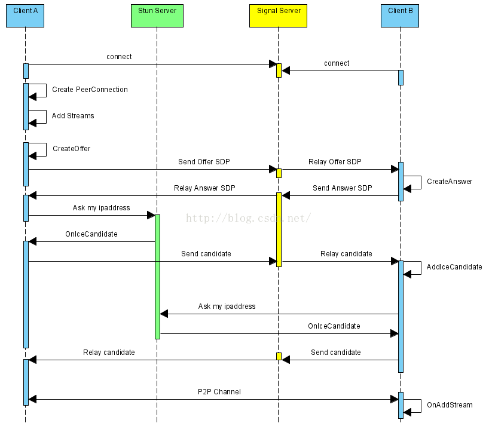

*************************
基于WebRTC实现页面浏览器视频通话-原理及实现
*************************

介绍
====
``WebRTC`` ，名称源自网页实时通信（Web Real-Time Communication）的缩写，是一个支持网页浏览器进行实时语音对话或视频对话的技术，是谷歌 2010 年以 6820 万美元收购 Global IP Solutions 公司而获得的一项技术。

原理
====
``WebRTC`` 是 ``HTML5`` 支持的重要特性之一，有了它，不再需要借助音视频相关的客户端，直接通过浏览器的 ``Web`` 页面就可以实现音视频对聊功能。而且 ``WebRTC`` 项目是开源的，我们可以借助 ``WebRTC`` 源码快速构建自己的音视频对聊功能。无论是使用前端 ``JS`` 的 ``WebRTC API`` 接口，还是在 ``WebRTC`` 源码上构建自己的对聊框架，都需要遵循以下执行流程：

上述序列中， ``WebRTC`` 并不提供 ``Stun`` 服务器和 ``Signal`` 服务器，服务器端需要自己实现。 ``Stun`` 服务器可以用 ``google`` 提供的实现 ``stun`` 协议的测试服务器( ``stun:stun.l.google.com:19302`` )， ``Signal`` 服务器则完全需要自己实现了，它需要在 ``ClientA`` 和 ``ClientB`` 之间传送彼此的 ``SDP`` 信息和 ``candidate`` 信息， ``ClientA`` 和 ``ClientB`` 通过这些信息建立 ``P2P`` 连接来传送音视频数据。由于网络环境的复杂性，并不是所有的客户端之间都能够建立 ``P2P`` 连接，这种情况下就需要有个 ``relay`` 服务器做音视频数据的中转，本文本着源码剖析的态度，这种情况就不考虑了。这里说明一下，  ``stun/turn`` 、 ``relay`` 服务器的实现在 ``WebRTC`` 源码中都有示例，真是个名副其实的大宝库。

上述序列中，标注的场景是 ``ClientA`` 向 ``ClientB`` 发起对聊请求，调用描述如下：

- ``ClientA`` 首先创建 ``PeerConnection`` 对象，然后打开本地音视频设备，将音视频数据封装成 ``MediaStream`` 添加到 ``PeerConnection`` 中。
- ``ClientA`` 调用 ``PeerConnection`` 的 ``CreateOffer`` 方法创建一个用于 ``offer`` 的 ``SDP`` 对象， ``SDP`` 对象中保存当前音视频的相关参数。 ``ClientA`` 通过 ``PeerConnection`` 的 ``SetLocalDescription`` 方法将该 ``SDP`` 对象保存起来，并通过 ``Signal`` 服务器发送给 ``ClientB`` 。
- ``ClientB`` 接收到 ``ClientA`` 发送过的 ``offer SDP`` 对象，通过 ``PeerConnection`` 的 ``SetRemoteDescription`` 方法将其保存起来，并调用 ``PeerConnection`` 的 ``CreateAnswer`` 方法创建一个应答的 ``SDP`` 对象，通过 ``PeerConnection`` 的 ``SetLocalDescription`` 的方法保存该应答 ``SDP`` 对象并将它通过 ``Signal`` 服务器发送给 ``ClientA`` 。
- ``ClientA`` 接收到 ``ClientB`` 发送过来的应答 ``SDP`` 对象，将其通过 ``PeerConnection`` 的 ``SetRemoteDescription`` 方法保存起来。
- 在 ``SDP`` 信息的 ``offer/answer`` 流程中， ``ClientA`` 和 ``ClientB`` 已经根据 ``SDP`` 信息创建好相应的音频 ``Channel`` 和视频 ``Channel`` 并开启 ``Candidate`` 数据的收集， ``Candidate`` 数据可以简单地理解成 ``Client`` 端的 ``IP`` 地址信息（本地 ``IP`` 地址、公网 ``IP`` 地址、 ``Relay`` 服务端分配的地址）。
- 当 ``ClientA`` 收集到 ``Candidate`` 信息后， ``PeerConnection`` 会通过 ``OnIceCandidate`` 接口给 ``ClientA`` 发送通知， ``ClientA`` 将收到的 ``Candidate`` 信息通过 ``Signal`` 服务器发送给 ``ClientB`` ， ``ClientB`` 通过 ``PeerConnection`` 的 ``AddIceCandidate`` 方法保存起来。同样的操作 ``ClientB`` 对 ``ClientA`` 再来一次。
- 这样 ``ClientA`` 和 ``ClientB`` 就已经建立了音视频传输的 ``P2P`` 通道， ``ClientB`` 接收到 ``ClientA`` 传送过来的音视频流，会通过 ``PeerConnection`` 的 ``OnAddStream`` 回调接口返回一个标识 ``ClientA`` 端音视频流的 ``MediaStream`` 对象，在 ``ClientB`` 端渲染出来即可。同样操作也适应 ``ClientB`` 到 ``ClientA`` 的音视频流的传输。

案例
====
项目详细介绍可参考： http://blog.csdn.net/leecho571/article/details/8146525

参考文档：

- https://blog.csdn.net/zeb_perfect/article/details/52869825

