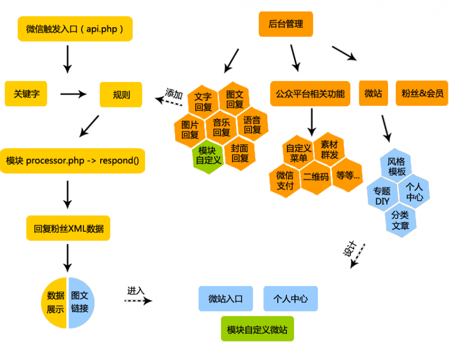

*****************************
微擎框架入口文件位置路径（Web端/App端/微信Api）
*****************************

微擎框架入口脚本是指应用启动的第一环节，根据用户开发端不同，目前微擎框架支持三个入口，即 ``Web端入口`` 、 ``App端入口`` 和 ``微信Api入口`` ：

Web端入口
=========
``Web`` 端入口主要负责微擎系统的后台管理功能，入口文件是 ``/web/index.php`` 。访问此入口有严格的权限判断，需要需要用户进行登录。此入口主要完成以下工作：

- 登录用户的身份验证
- 初始化登录用户的身份信息，分派管理员权限或是操作员权限
- 权限菜单划分及权限判断
- 加载系统配置
- 路由用户的请求

App端入口
==========
``App`` 端入口主要负责微擎系统的前端“微站”、“个人中心”及其它普通用户访问的功能。入口文件是 ``/app/index.php`` 。访问“微站”无需身份验证，访问“个人中心”则要求用户进行登录。此入口主要完成以下工作：

- 初始化当前公众号的数据
- 初始化微站站点信息、风格、模板、导航等数据
- 初始化粉丝&会员的身份信息（如果有权限获取）
- 加载系统配置
- 路由用户的请求

微信Api入口
===========
微信 ``Api`` 入口主要负责处理微信公众平台请求微擎系统的关键字、图片、语音等数据，入口文件是 ``api.php`` 。此入口只用于公众平台访问。此入口主要完成以下工作：

- 初始化当前公众号的数据
- 解析公众平台推送过来的数据结构，转化为微擎消息结构
- 根据消息结构中的关键字或是事件匹配到相应的模块
- 调用模块的processor类返回数据给微信公共平台
