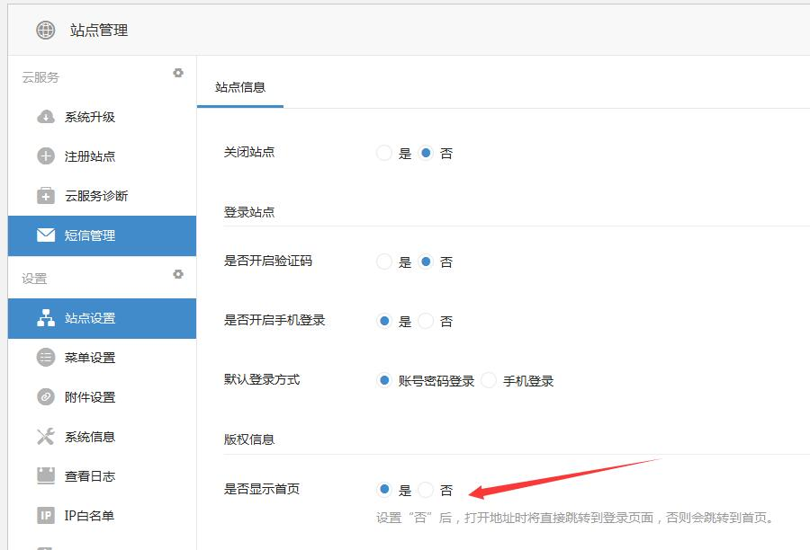
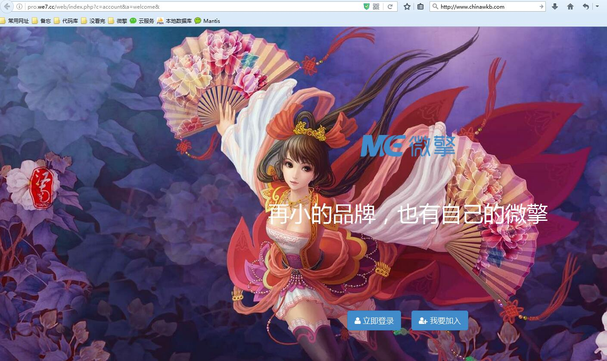
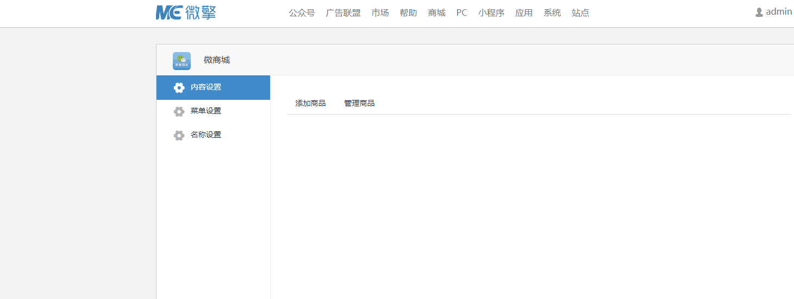
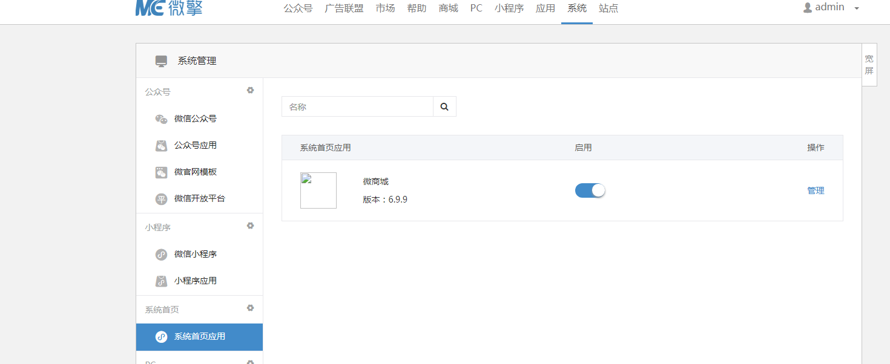

******
定义微擎后台首页
******

开启系统后台首页
==============
系统首页是属于微擎商业版功能，用户可以自行选择开启或是关闭。配置如下：

开启后，进入微擎后，默认跳转至首页。效果如下：

自定义系统后台首页
=================
当设计模块时，增加自定义系统首页时，需要完善模块目录下的 ``systemwelcome.php`` 文件中的 ``systemWelcomeDisplay()`` 方法，此方法返回的内容将会显示在系统首页中。

.. code-block:: php

	class We7_demoModuleSystemWelcome extends WeModuleSystemWelcome {
	    public function systemWelcomeDisplay() {
	        echo '系统首页显示内容';
	        //或是也可以引用一个模板
	        include $this->template('display');
	    }
	}

为自定义首页添加其它功能
======================
如果需要在自定义系统首页中增加功能，比如要增加幻灯片，公告等功能，可以在设计模块时，增加功能菜单，进入模块后将后在左侧显示，如下：

创建菜单时，指定菜单标识，需要在 ``systemwelcome.php`` 文件中实现相应的方法， ``doPage菜单标识()`` ：

.. code-block:: php

	class We7_demoModuleSystemWelcome extends WeModuleSystemWelcome {
	    public function systemWelcomeDisplay() {
	        echo '系统首页显示内容';
	        //或是也可以引用一个模板
	        //此处获取幻灯片配置，用于展示
	        include $this->template('display');
	    }
	    public function doPageSetting() {
	        global $_W;
	        //此处增加保存幻灯片的操作
	        include $this->template('setting');
	    }
	    public function doPageContent() {
	        global $_W;
	        include $this->template('goods');
	    }
	}

多个自定义系统首页模块切换
========================
用户可在 ``系统 -> 系统首页应用`` 里选择系统首页模块，选择系统首页由哪个模块应用来显示。同一时间只允许一个模块生效。

进入指定模块来配置站点基本信息。