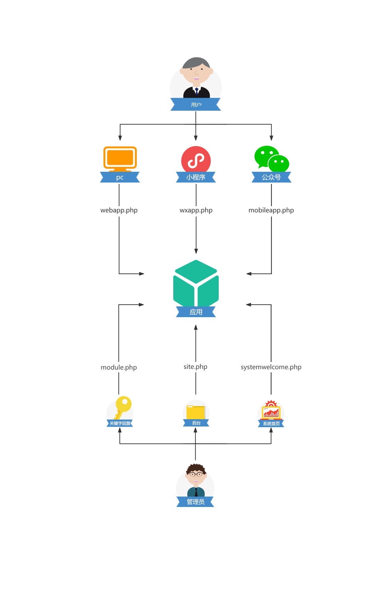

***************
微擎模块功能文件
***************

概览
====

微擎应用模块的服务端文件结构大概如下：

后台功能文件
-----------

- ``site.php`` 实现后台管理员操作应用模块业务功能，需要展示的功能需要在设计模块时注册菜单。
- ``module.php`` 实现后台管理员操作关键字回复功能

前台功能文件
------------
前台根据适配不同的终端，需要完善相关的功能文件

- ``wxapp.php`` 小程序端服务端文件，通过接口的形式，实现小程序数据处理功能
- ``webapp.php`` PC端前台功能文件，如果模块需要有PC端展示功能，需要完善此文件
- ``mobileapp.php`` 公众号的手机端功能文件，同旧版模块中 ``site.php`` 中 ``doMobile`` 相关函数，为了规范单独成一个文件

其它功能文件
------------

- ``systemwelcome.php`` 自定义用户或是管理员进入微擎系统首页时展示的内容

site.php
=========
功能介绍
--------
定义应用后台功能
^^^^^^^^^^^^^^^

以 ``doWeb+入口标识`` 为方法名，设计模块时，需要先在 ``管理中心菜单`` 中注册。当然，如果一些 ``ajax`` 地址或是你不想显示在左侧菜单上，也可以不在设计模块时注册这些菜单，只要按照访问路由方法，一样是可以调用到。

定义手机端页面
^^^^^^^^^^^^^
以 ``doMobile+入口标识`` 为方法名，供手机端接口或是页面使用。此方法不一定要在设计模块时注册，只要按照访问路由方法，一样是可以调用到。只是如果此页面是不验证登录的，需要在设计模块时，设置此标识 ``无需要登录访问`` 。可以查看 ``manifest`` 文件

.. note:: 注意，为了规范，已经把这个移到单独的文件中。如小程序服务端文件(wxapp.php)、PC端前台功能文件(webapp.php)、公众号的手机端功能文件(mobileapp.php)。

具体功能实现
-----------
此例中，将实现一个查看所有活动列表的功能。开发应用应该使用命名空间，避免代码冲突。

代码如下：

.. code-block:: php

	namespace rcdonkey;
	/**
	 * 接龙报名模块微站定义
	 *
	 * @author 米粥
	 * @url 
	 */
	defined('IN_IA') or exit('Access Denied');
	class Rcdonkey_signupModuleSite extends \WeModuleSite {

		// 显示活动列表
	    public function doWebActivity() {
	        global $_W, $_GPC;
	        $pageindex = max(1, intval($_GPC['page']));
	        $pagesize = 15;
	        $status = array(
	            '1' => '进行中',
	            '2' => '进行中',
	            '3' => '已结束',
	        );
	        $activity_list = pdo_getslice('rcdonkey_activity', array(), array($pageindex, $pagesize), $total, array(), 'id', 'id desc');
	        if (!empty($activity_list)) {
	            foreach ($activity_list as &$activity) {
	                $activity['createtime'] = date('Y-m-d H:i', $activity['createtime']);
	                $activity['join_deadline'] = date('Y-m-d', $activity['join_deadline']);
	                $activity['code'] = tomedia($activity['code']);
	            }
	            unset($activity);
	        }
	        $pager = pagination($total, $pageindex, $pagesize);
	        include $this->template('activity-list');
	    }

	    // 删除活动
	    public function doWebDeleteActivity() {
	        global $_GPC;
	        $id = intval($_GPC['id']);
	        $activity = pdo_get('rcdonkey_activity', array('id' => $id));
	        if (empty($activity)) {
	            message('删除的活动不存在或是已经被删除');
	        }
	        if (pdo_delete('rcdonkey_activity', array('id' => $id))) {
	            message('活动删除成功', referer(), 'success');
	        } else {
	            message('活动删除失败，请重试');
	        }
	    }

	    // 编辑活动
	    public function doWebEditActivity() {
	        global $_GPC;
	        $id = intval($_GPC['id']);
	        $activity = pdo_get('rcdonkey_activity', array('id' => $id));
	        if (empty($activity)) {
	            message('删除的活动不存在或是已经被删除');
	        }
	        if (checksubmit('submit')) {
	            if (empty($_GPC['title']) || empty($_GPC['join_deadline'])) {
	                message('请输入活动的标题和截止日期');
	            }
	            $data = array(
	                'title' => $_GPC['title'],
	                'description' => $_GPC['description'],
	                'join_total' => intval($_GPC['join_total']),
	                'join_deadline' => strtotime($_GPC['join_deadline']),
	                'status' => intval($_GPC['status']),
	            );
	            pdo_update('rcdonkey_activity', $data, array('id' => $id));
	            message('更新成功', referer(), 'success');
	        }
	        include $this->template('activity-detail');
	    }
	}

清单配置：

.. code-block:: xml

	<menu>
		<entry title="活动列表" do="activity" state="" direct="false"/>
	</menu>

- title：操作名称就是将来显示到左侧的菜单名称；
- do：入口标识就是实现的函数需要在 ``site.php`` 中 ``WeSite`` 类中定义；
- state：附加数据是指进入链接后面附加一些 ``GET`` 参数，例如： ``&user=1&post=2`` ；
- direct：是否需要登录访问，指进入时不做登录验证，可随意访问。

文件中有三个方法，分别是活动列表，删除活动，编辑活动，其中只有 活动列表，在设计模块的时候注册了，因为这个菜单要显示到模块左侧，其它菜单是由自己在 ``HTML`` 页面中加入的，所以可以不事先注册。

要调用 ``site.php`` 中的其它方法，可以在页面中使用 `生成模块内链接地址 <http://s.w7.cc/index.php?c=wiki&do=view&id=1&list=164>`_ 方法来生成访问链接

module.php
===========
功能介绍
--------

- 此文件功能主要嵌入系统的 "自动回复" -> "关键字回复" 中，微擎系统中。当设置模块时勾选 ``是否要嵌入规则`` 时，才可以嵌入规则。
- 实现应用的全局配置功能

关于关键字回复，系统只支持最基本的 ``文字`` 、 ``图文`` 、 ``语音`` 、 ``视频`` 等基本元素，而且这些回复需要操作员详细的设置每一项，标题、内容、链接。

但是对于模块来说，需要对于这些基本的回复进行 ``二次封装`` ，生成出来标题、内容、链接这些元素。所以模块对系统自动回复扩展或是封装就需要通过 ``module.php`` 这个文件来嵌入。

在微擎老版本当中，模块开启 ``存在全局参数配置`` 时，会在此文件中的 ``settingsDisplay`` 方法来实现，由于新版微擎引入了 ``云参数配置`` 的功能，此函数已经不需要开发者来手动实现了，系统会自动调用云 ``API`` 来完善功能。

规范及约定
----------

- ``Rcdonkey_signuptest`` 为模块标识，类名的定义遵循 ``模块标识+Module`` 规则
- 此类必须继承 ``WeModule`` 类

.. code-block:: php

	namespace rcdonkey;
	/**
	 * 接龙报名模块定义
	 *
	 * @author 米粥
	 * @url 
	 */
	defined('IN_IA') or exit('Access Denied');
	class Rcdonkey_signuptestModule extends WeModule {
	    
	    // web/source/home/welcome.ctrl.php中$do == 'ext'代码区中调用
	    // 注意区别系统后台首页模块方法
	    public function welcomeDisplay($menus = array()) {
	        //这里来展示DIY管理界面，用于进入模块后自定义显示页面
	        include $this->template('welcome');
	    }
	    
	    // framework/model/module.mod.php中module_build_form中调用
	    public function fieldsFormDisplay($rid = 0) {
	        //要嵌入规则编辑页的自定义内容，这里 $rid 为对应的规则编号，新增时为 0
	        //显示新增或是编辑规则页面
	        include $this->template('rule');
	    }
	    
	    // web/source/platform/reply.ctrl.php中$do == 'post'代码区中调用
	    public function fieldsFormValidate($rid = 0) {
	        //规则编辑保存时，要进行的数据验证，返回空串表示验证无误，返回其他字符串将呈现为错误提示。这里 $rid 为对应的规则编号，新增时为 0
	        return '';
	    }
	    // web/source/platform/reply.ctrl.php中$do == 'post'代码区中调用
	    public function fieldsFormSubmit($rid) {
	        //规则验证无误保存入库时执行，这里应该进行自定义字段的保存，需要自定义数据字段。这里 $rid 为对应的规则编号
	    }
	    
	    // web/source/platform/reply.ctrl.php中$do == 'delete'代码区中调用
	    public function ruleDeleted($rid) {
	        //删除规则时调用，这里 $rid 为对应的规则编号
	    }
	    
	    // 新版本
	    public function settingsDisplay($settings) {
	        global $_W, $_GPC;
	        load()->classs('cloudapi');
	        $api = new CloudApi(true);
	        // 配置页面
	        $iframe = $api->url('debug', 'settingsDisplay', array(
	            'referer' => urlencode($_W['siteurl']),
	            'version' => $this->module['version'],
	            'v' => random(3),
	        ), 'html');
	        if (is_error($iframe)) {
	            message($iframe['message'], '', 'error');
	        }
	        // 配置提交
	        if($_W['ispost']) {
	            $setting = $_GPC['setting'];
	            $setting = $api->post('debug', 'saveSettings', array('setting' => $setting, 'version' => $this->module['version'], 'v' => random(3),), 'json');
	            if (is_error($setting)) {
	            }
	            $this->saveSettings($setting);
	        }
	        include $this->template('setting');
	    }

	    // 旧版本设置全局配置
		public function settingsDisplay($settings) {
			global $_W, $_GPC;
			//点击模块设置时将调用此方法呈现模块设置页面，$settings 为模块设置参数, 结构为数组。这个参数系统针对不同公众账号独立保存。
			//在此呈现页面中自行处理post请求并保存设置参数（通过使用$this->saveSettings()来实现）
			if(checksubmit('submit')) {
				//字段验证, 并获得正确的数据$dat
				$dat['option1'] = $_GPC['option1'];
				$this->saveSettings($dat);
				message('配置参数更新成功！', referer(), 'success');
			}
			//这里来展示设置项表单
			include $this->template('settings');
		}
	}

systemwelcome.php
=================
参考后台首页

.. code-block:: php

	defined('IN_IA') or exit('Access Denied');
	class Demo_welcomeModuleSystemWelcome extends WeModuleSystemWelcome {

	    // 后台用户登录前访问页面
	    public function systemWelcomeDisplay() {
	        echo '系统首页显示内容';
	        //或是也可以引用一个模板
	        //include $this->template('display');
	    }

	    // 后台管理设置页面
	    public function doPageSetting() {
	        global $_W;
	        //此处增加保存幻灯片的操作
	        include $this->template('setting');
	    }

	    public function doPageContent() {
	        global $_W;
	        echo '内容';
	    }
	}

webapp.php
===========
功能介绍
---------
``webapp.php`` 是定义 ``PC`` 版应用前台功能文件。

规范及约定
----------

- ``Rcdonkey_signup`` 为模块标识，类名的定义遵循 ``模块标识+ModuleWebapp`` 规则
- 此类必须继承 WeModuleWebapp 类
- 所有对外（小程序）公布的接口函数，必须是以 doPage 开头

这个文件就是 ``PC`` 的前端文件。其结构大概如下：

.. code-block:: php

	/**
	 * 接龙报名模块小程序接口定义
	 *
	 * @author 米粥
	 * @url 
	 */
	defined('IN_IA') or exit('Access Denied');
	class Rcdonkey_signupModuleWebapp extends WeModuleWebapp {

	    public function doPageIndex() {
	    }

	    public function doPageGoodsList() {
	        include $this->template('web/goods/list');
	    }
	}

wxapp.php
==========
功能介绍
--------
``wxapp.php`` 是定义小程序获取数据或是操作数据的接口文件。小程序中一切与后端交流的数据都是通过 ``API`` 来实现。

规范及约定
----------

- ``Rcdonkey_signup`` 为模块标识，类名的定义遵循 ``模块标识+ModuleWxapp`` 规则
- 此类必须继承 ``WeModuleWxapp`` 类
- 所有对外（小程序）公布的接口函数，必须是以 ``doPage`` 开头

这个文件就是小程序的后端文件。其结构大概如下：

.. code-block:: php

	<?php
	/**
	 * 接龙报名模块小程序接口定义
	 *
	 * @author 米粥
	 * @url 
	 */
	defined('IN_IA') or exit('Access Denied');
	class Rcdonkey_signupModuleWxapp extends WeModuleWxapp {
	    
	    private function checkLogin() {
	        global $_W;
	        if (empty($_W['fans'])) {
	            return error(1, '请先登录');
	        }
	        return true;
	    }

	    /**
	     * 添加活动
	     */
	    public function doPagePostActivity() {
	        //新增一个活动
	        global $_W, $_GPC;
	        $id = intval($_GPC['id']);
	        $login_success = $this->checkLogin();
	        if (is_error($login_success)) {
	            return $this->result($login_success['errno'], $login_success['message']);
	        }
	        if (empty($_GPC['title']) || empty($_GPC['description']) || empty($_GPC['joindeadline'])) {
	            return $this->result(2, '请填写完整活动内容');
	        }
	        $join_deadline = strtotime($_GPC['joindeadline']);
	        if (empty($join_deadline)) {
	            $join_deadline = strtotime("+7 day");
	        }
	        $require = explode(',', $_GPC['require']);
	        if (in_array('mobile', $require)) {
	            $require_mobile = 1;
	        }
	        if (in_array('realname', $require)) {
	            $require_realname = 1;
	        }
	        $data = array(
	            'title' => trim($_GPC['title']),
	            'description' => trim($_GPC['description']),
	            'join_deadline' => $join_deadline,
	            'join_total' => 0,
	            'organizer_openid' => $_W['fans']['openid'],
	            'organizer_nickname' => $_W['fans']['nickname'],
	            'organizer_avatar' => $_W['fans']['avatar'],
	            'longitude' => $_GPC['longitude'],
	            'latitude' => $_GPC['latitude'],
	            'status' => 1,
	            'createtime' => TIMESTAMP,
	            'require_realname' => $require_realname,
	            'require_mobile' => $require_mobile,
	            'fee' => floatval($_GPC['fee']),
	        );
	        if (empty($id)) {
	            if (pdo_insert('rcdonkey_activity', $data)) {
	                $id = pdo_insertid();
	                $code = $this->makeActivityCode($id);
	                if (!is_error($code)) {
	                    pdo_update('rcdonkey_activity', array('code' => $code), array('id' => $id));
	                }
	                return $this->result(0, '发布成功', array('id' => $id));
	            }
	        } else {
	            $activity = $this->getActivity($id);
	            if ($_W['openid'] != $activity['organizer_openid']) {
	                return $this->result(2, '您没有权限修改该活动');
	            }
	            $data = array(
	                'title' => trim($_GPC['title']),
	                'description' => trim($_GPC['description']),
	                'join_deadline' => $join_deadline,
	            );
	            pdo_update('rcdonkey_activity', $data, array('id' => $id));
	            return $this->result(0, '修改成功', array('id' => $id));
	        }
	        return $this->result(3, '发布失败，请重试');
	    }

	    public function doPageDetail() {
	        global $_W, $_GPC;
	        $id = intval($_GPC['id']);
	        if (empty($id)) {
	            $this->result(1, '活动不存在或是已经被删除');
	        }
	        $activity = $this->getActivity($id);
	        $join_user = pdo_get('rcdonkey_join_list', array('openid' => $_W['openid'], 'activity_id' => $id));
	        $activity['already_join'] = !empty($join_user) ? true : false;
	        $this->result(0, '', $activity);
	    }

	    private function getActivity($id) {
	        global $_W;
	        if (empty($id)) {
	            return array();
	        }
	        $activity = pdo_get('rcdonkey_activity', array('id' => $id));
	        if (empty($activity)) {
	            return error(1, '活动不存在或是已经被删除');
	        }
	        $activity['description'] = emoji_unicode_decode($activity['description']);
	        if (empty($activity['code'])) {
	            $code = $this->makeActivityCode($id);
	            if (!is_error($code)) {
	                pdo_update('rcdonkey_activity', array('code' => $code), array('id' => $id));
	            }
	            $activity['code'] = $code;
	        } else {
	            $activity['code'] = tomedia($activity['code']);
	        }
	        if ($activity['status'] == 3) {
	            $activity['join_deadline'] = TIMESTAMP - 38400;
	        }
	        $activity['join_deadline_date'] = date('Y-m-d H:i', $activity['join_deadline']);
	        $activity['join_list'] = pdo_getall('rcdonkey_join_list', array('activity_id' => $id), array(), 'openid', 'id DESC');
	        if (!empty($activity['join_list'])) {
	            foreach ($activity['join_list'] as $i => &$join_user) {
	                $join_user['join_date'] = date('Y-m-d H:i', $join_user['createtime']);
	            }
	        }
	        if ($_W['openid'] == $activity['organizer_openid']) {
	            $activity['is_manager'] = true;
	        }
	        if ($activity['join_deadline'] < TIMESTAMP) {
	            pdo_update('rcdonkey_activity', array('status' => 3), array('id' => $id));
	            $activity['status'] = 3;
	        }
	        return $activity;
	    }
	}

结果返回
--------

由于小程序中沟通数据是采用 ``API`` 的形式，所以数据都是以 ``JSON`` 的形式进行返回，在这里可以直接调用 ``$this->result()`` 来返回结果， `具体查看函数说明 <http://s.w7.cc/%E3%80%82/index.php?c=wiki&do=view&id=1&list=514>`_

小程序端如何请求
---------------
所有对外（小程序）公布的接口函数，必须是以 ``doPage`` 开头，比如下方实例中 ``doPagePostActivity()`` ，表示新增一个活动，在小程序中直接使用 ``app.util.request()`` 函数来请求。代码如下，其它函数引用同理。

.. code-block:: js

	app.util.request({
	    url: 'entry/wxapp/postactivity',
	    data: {
	        m: 'rcdonkey_signup',
	        title : form.title,
	        /*省略部分代码*/
	    },
	    method : 'post',
	    success: function (response) {
	        /*省略部分代码*/
	    },
	    fail : function(response) {
	        if (response.data.message) {
	            app.util.message(response.data.message, '', 'error');
	        }
	    }
	});

result()
---------
.. code-block:: php

    result($errno, $message, $data = '')

以 ``JSON`` 的形式返回接口数据

参数
^^^^

- $errno 错误代码，通常0表示没有错误，非0数值表示错误
- $message 错误信息或是成功信息
- $data 要返回的数据，可以是数组，字符串，数值等

返回值
^^^^^^

``JSON`` 数据格式

.. code-block:: json

    {"errno":0,"message":"活动添加成功","data":{"title":"活动名称","id":1}}

.. code-block:: php

	public function doPageDetail() {
	    global $_W, $_GPC;
	    $id = intval($_GPC['id']);
	    if (empty($id)) {
	        $this->result(1, '活动不存在或是已经被删除');
	    }
	    $activity = $this->getActivity($id);
	    $this->result(0, '获取活动详情成功', $activity);
	}

mobileapp.php
=============

``mobileapp.php`` 公众号的手机端前台功能文件，同旧版模块中 ``site.php`` 中 ``doMobile`` 相关函数，为了规范单独成一个文件。

.. code-block:: php

	// 公众号前端访问函数
	class Demo_webappModuleMobile extends WeModuleMobile {

	    public function doMobileFengmian($settings) {
	        echo '封面内容';
	    }

	}

receiver.php
=============

功能介绍
--------
此文件功能主要是在接口处理完跟客户交互的相关逻辑后，模块最后执行的一些脚本。

规范及约定
----------

- ``We7_test`` 为模块标识，类名的定义遵循 ``模块标识+ModuleReceiver`` 规则
- 此类必须继承 ``WeModuleReceiver`` 类
- 所有的接口函数，必须是 ``receive``

其结构大概如下：

.. code-block:: php

	class We7_testModuleReceiver extends WeModuleReceiver {
	    public function receive() {
	        global $_W;
	        //这里写处理逻辑
	    }
	}

hook.php
=========
模块嵌入点
----------
模块嵌入点是为了解决模块之间或是插件与主模块之间的功能调用、功能占位等问题。

举个例子，主模块功能是商城功能，包含一个插件功能是支付功能。主模块在遇到支付功能按钮时，可以以钩子的形式来处理，先占位，系统会判断用户是否已经安装支付插件，如果有则显示出来支付功能按钮，如果没有则什么也不显示。

定义模块嵌入点
-------------

- 模块嵌入点需要在模块目录下定义 ``hook.php``
- ``We7_testhookModuleHook`` 为模块标识，类名的定义遵循 ``模块标识+ModuleHook`` 规则
- 此类必须继承 ``WeModuleHook`` 类
- web端的嵌入点以 ``hookWeb + Hook名称`` 来定义
- app端的嵌入点以 ``hookMobile + Hook名称`` 来定义

.. code-block:: php

	class We7_testhookModuleHook extends WeModuleHook {
	    // web端的嵌入点
	    public function hookMobileTest() {
	        // 将调用 teamplate/mobile/testhook.html
	        include $this->template('testhook');
	    }
	    // app端的嵌入点
	    public function hookWebTest() {
	        // 将调用 teamplate/testhook.html
	        include $this->template('testhook');
	    }
	}

调用Hook
--------

- 调用Hook时，web端与app端会分别调用各自的Hook
- 系统会自动检测是否存在该Hook,进行调用数据
- 此标签会自动被替换定义嵌入点的内容

.. code-block:: php

    {hook func="test" module="we7_testhook" pagesize="15"}{/hook}

此标签除了 ``func`` 和 ``module`` 是必填的参数外，其余参数可由开发者自定义，会原样传入到嵌入点的函数中。

