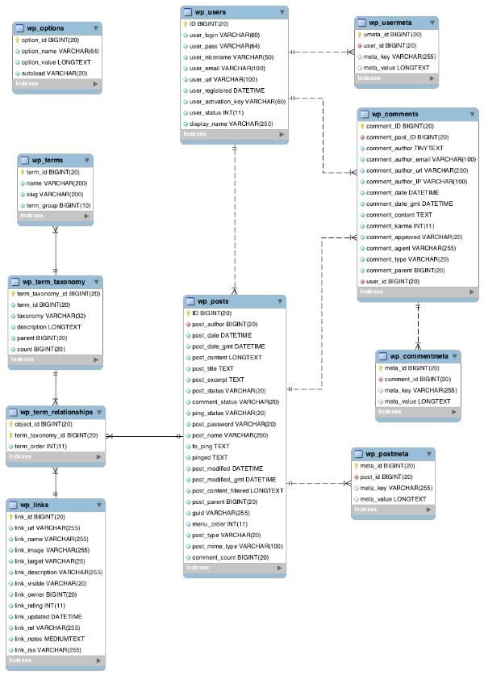
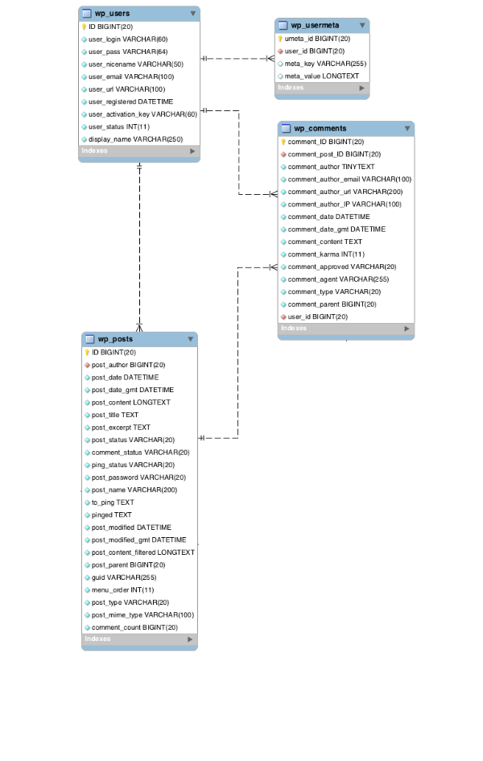

*************
WordPress中的数据
*************

WordPress 的数据库结构
=====================

WordPress中的内容类型
====================
有以下四种: - 文章( ``post`` ) - 评论( ``comments`` ) - 用户( ``users`` ) - 链接( ``links`` )

文章
----
文章是 ``WordPress`` 中最重要的内容类型。这个术语可能会让你感到困惑，文章是描述 ``wp_posts`` 这个表中的所有内容但是也是用来描述一个特定的 `文章类型 <https://codex.wordpress.org/Post_Types>`_ 。它既指一种文章类型( ``post type`` )，又指存储在特定数据表中的内容类型( ``content type`` )。

.. code-block:: php

    'post_type' => 'post'

- 文章(Post Type: 'post')
- 页面(Post Type: 'page')
- 自定义文章类型(register_post_type())
- 附件(Post Type: 'attachment')
- 修订版本(Post Type: 'revision')
- 导航菜单项(Post Type: 'nav_menu_item')

前三种文章类型对于 ``WordPress`` 开发者来说很熟悉，但后面的两种也属于文章。文章的每个版本也都保存在 ``wp_posts`` 表中并通过它的父来关联( ``post_parent`` 字段)，导航菜单项作为文章来保存并是通过一个查询语句来显示的。这就是为什么当你错误使用 ``pre_get_posts()`` 过滤器时会有导航菜单突然出现。

**默认的Post类型**

+-----------------------+--------------------------------------------+-----------------------------------------------------------------------------------------------------------------------------------------------------------------------+
| POST类型              | 用途                                       | 说明                                                                                                                                                                  |
+=======================+============================================+=======================================================================================================================================================================+
| Post                  | 博客文章或其他相似的                       | 主要的post类型-在主博客页面列出                                                                                                                                       |
+-----------------------+--------------------------------------------+-----------------------------------------------------------------------------------------------------------------------------------------------------------------------+
| Page                  | 静态页面                                   | 用来单独显示-一般不用于存档（尽管可以这么用）                                                                                                                         |
+-----------------------+--------------------------------------------+-----------------------------------------------------------------------------------------------------------------------------------------------------------------------+
| Attachment            | 文档和图片(可能附录或不附录到指定的post中) | 上传到post的媒体文件将会在它的post_parent字段拥有那个post的ID。通过仪表盘的媒体界面上传的图片的该字段为空。guid字段用来存储媒体文件的url                              |
+-----------------------+--------------------------------------------+-----------------------------------------------------------------------------------------------------------------------------------------------------------------------+
| Revision              | 每一个post的单个的修订                     | 每一次的修订都会附录到post:post的ID会存储在修订的post_parent字段。                                                                                                    |
+-----------------------+--------------------------------------------+-----------------------------------------------------------------------------------------------------------------------------------------------------------------------+
| Navigation Menu Items | 单独的导航菜单项                           | 每一个菜单都包含许多的导航项，每一个会被存储为一个post，menu_order字段用来存储关于导航菜单项的顺序，其他的数据比如目标（target）和父菜单项存储为wp_postmeta表的记录。 |
+-----------------------+--------------------------------------------+-----------------------------------------------------------------------------------------------------------------------------------------------------------------------+

自定义的 ``post`` 类型可以注册为与内置 ``post`` 类型行为相同（除了 ``attachment`` ），但是默认值是 ``post`` 。每一种 ``post`` 类型都有自己的接口。

**posts之间的关系**

如你从上表中看到的， ``post_parent`` 是很重要的一个字段，它存储着不同 ``posts`` 类型的关系信息。包括：

- 父页面和子页面
- 修订和与此相关的 ``post``
- 附件和被上传到的 ``post`` 你可以在你的查询中用不同的方法使用 ``post_parent`` 字段。比如查询一个给定页面的父页面，你可以使用下面的方法，这里的 ``ID`` 是父页面的 ``ID`` :

.. code-block:: php

    'post_parent' => 'ID'

你也可以使用一个相似的查询来显示所有上传到给定 ``post`` 的附件，或者作为代替，你可以查询那些没有父元素的附件（即是通过仪表盘的媒体界面直接上传的附件）。 为实现这个，你可以使用下面的代码：

.. code-block:: php

    'post_parent' => '0'

评论
----
评论是保存在它自己的数据库表 ``wp_comments`` 中。它的原理相对文章来说比较简单，每条评论都可以通过 ``wp_commentmeta`` 表来附加元数据，但是不同的内容是在不同的字段中。 评论和文章是一对多的关系连接的，而且每条评论都可以通过 ``comment_parent`` 字段实现自连接——这是为了能标示出某条评论是对另外一条评论的回复。如果是已经登录的用户发表的评论，还可以和用户表 ``wp_users`` 关联。

用户
----
用户也有自己的表 ``wp_users`` ，而且也有保存元数据的表 ``wp_usermeta`` 。 ``WordPress`` 在 ``wp_users`` 表中存储用户数据。这个表会链接到 ``wp_posts`` 和 ``wp_comments`` :

``WordPress`` 还把用户数据存储到另外两个表中：

- 额外的用户元数据被存储到 ``wp_usermeta`` 。
- 没有登录的用户的评论数据被存储在 ``wp_comments`` 表中。

在这个系列的关于 ``Wordpress`` 数据的本部分内容中，我将会查看 ``Wordpree`` 怎样存储用户数据和我们怎么才能访问它，首先看 ``wp_users`` 表。

+---------------------+--------------------------------------------------------------------------------------------+--------------------------+
| 字段                | 存储内容                                                                                   | 说明                     |
+=====================+============================================================================================+==========================+
| ID                  | 用户的ID                                                                                   | 自动生成                 |
+---------------------+--------------------------------------------------------------------------------------------+--------------------------+
| user_login          | 用户名                                                                                     | 必需                     |
+---------------------+--------------------------------------------------------------------------------------------+--------------------------+
| user_pass           | 密码                                                                                       | 注册时未提供的话自动生成 |
+---------------------+--------------------------------------------------------------------------------------------+--------------------------+
| user_nicename       | 昵称                                                                                       | 没有手动输入时自动生成   |
+---------------------+--------------------------------------------------------------------------------------------+--------------------------+
| user_email          | 邮件地址                                                                                   | 必需                     |
+---------------------+--------------------------------------------------------------------------------------------+--------------------------+
| user_url            | 站点                                                                                       | 非必需                   |
+---------------------+--------------------------------------------------------------------------------------------+--------------------------+
| user_registered     | 用户注册的日期与时间                                                                       | 自动生成                 |
+---------------------+--------------------------------------------------------------------------------------------+--------------------------+
| user_activation_key | 用户激活码                                                                                 | 自动生成                 |
+---------------------+--------------------------------------------------------------------------------------------+--------------------------+
| user_status         | 用户状态，存储为数字-比如：这个值告诉Wordpress是否用户已经通过邮件确认注册。不存储用户角色 | 自动生成                 |
+---------------------+--------------------------------------------------------------------------------------------+--------------------------+
| display_name        | 公开显示的名称                                                                             | 没有手动输入时自动生成   |
+---------------------+--------------------------------------------------------------------------------------------+--------------------------+

可以看到，除了字段( ``userurl`` ),其它所以的字段要么是在注册时强制输入的，要么是自动生成的。

**用户元数据**

除了 ``wp_users`` 中的数据，还有其他的为所有用户创建的数据存储在 ``wp_usermeta`` 表中，比如用户规则和权限。这个表还存储其他设置来增强用户体验，比如用户选择的管理颜色和关于侧边栏和仪表盘显示的设置。 这是当你想为用户通过主题和插件创建额外的字段时使用的表-你永远不应该添加字段到主要的 ``wp_users`` 表。 ``wp_usermeta`` 表的每条记录包含 4 个字段：

- ID – 该条记录的 ID
- user_id – 链接到 wp_users
- meta_key
- meta_value

要创建新的用户元数据记录，可以使用 ``add_user_meta()`` 函数：

.. code-block:: php

    add_user_meta( $user_id, $meta_key, $meta_value, $unique );

这个函数的第四个参数( ``$unique`` )是可选的，表明 ``meta_key`` 字段的值是否唯一。 一旦你添加了用户元数据，你可以通过 ``get_user_meta()`` 函数输出在每个用户的作者页面中，或者为一个具体的键创建一个包含所有用户的值列表。

**用户和其他内容的关系**

用户可以被链接到两种类型的内容： ``posts`` 和 ``comments`` 。在 ``posts`` 中，总会有一个是作者的用户。这个关系是在 ``wp_posts`` 表的 ``post_auther`` 字段和 ``wp_users`` 表的 ``ID`` 字段之间。 ``Comments`` 不总是有一个链接到 ``wp_users`` 表的链接：只有评论者是已登录用户的时候才会被创建。在这种情况下，链接是在 ``wp_users`` 表的 ``ID`` 字段和 ``wp_comments`` 表的 ``user_ID`` 字段之间。 如果评论者不是登录用户，细节会被直接记录到 ``wp_comments`` 表中，此时使用 ``comment_auther`` , ``comment_auther_email`` , ``comment_author_url`` 和 ``comment_auther_IP`` 字段。

链接
----
最后一部分内容是链接。它已经被 ``WordPress`` 所淘汰，从 3.5 版本开始就变为默认不可用的。 链接的工作原理相对文章来说要简单，它们有自己的内容而且还可以分类。然而，它又是和文章不同的，它们之间有很多不同的字段，用来保存链接的目标（target），描述等等。它并没有和用户挂钩，所以也不能分配到一个用户上，它们也有没有字段用于标示到文章上——但是你可以在归档页面中通过分类来包括它们。 这些内容类型会被附加一些数据：

- 分类
- 标签 -
- 自定义分类法和分类项目
- 文章元数据

此外，还有其他类型的内容是作为不同的方式来存储的：

- 小工具
- 选项
- 用户
- 站点（多站点才有）
- 硬编码内容（主题或插件中）
- 来自其他地方的内容（通过反馈、流或者其他技术的第三方内容）

所有的这些内容都保存在数据库中的某个地方（或者在主题或者插件中，关于这点我将会展示）。

内容和数据库表的关系
===================
已经看过了 ``WordPress`` 中 的内容类型和存储它们的数据库表，这个有助于我们把它们关联起来。下面的表展示了每个表存储的内容类型。

+----------------+-----------------------------------------+
| CONTENT TYPE   | TABLE(S)                                |
+================+=========================================+
| 文章           | wp_posts                                |
+----------------+-----------------------------------------+
| 页面           | wp_posts                                |
+----------------+-----------------------------------------+
| 自定义文章类型 | wp_posts                                |
+----------------+-----------------------------------------+
| 附件           | wp_posts                                |
+----------------+-----------------------------------------+
| 导航菜单项目   | wp_posts                                |
+----------------+-----------------------------------------+
| 文章元数据     | wp_post_meta                            |
+----------------+-----------------------------------------+
| 链接           | wp_links                                |
+----------------+-----------------------------------------+
| 分类           | wp_terms                                |
+----------------+-----------------------------------------+
| 标签           | wp_terms                                |
+----------------+-----------------------------------------+
| 分类法项目     | wp_terms                                |
+----------------+-----------------------------------------+
| 自定义分类法   | wp_term_taxonomy                        |
+----------------+-----------------------------------------+
| 小工具         | wp_options                              |
+----------------+-----------------------------------------+
| 选项           | wp_options                              |
+----------------+-----------------------------------------+
| 用户           | wp_users                                |
+----------------+-----------------------------------------+
| 硬编码内容     | wp_posts （如果添加到文章中）           |
+----------------+                                         |
| -              | wp_options （如果添加到小工具中）       |
+----------------+                                         |
| -              | 主题和插件文件（如果是硬编码）          |
+----------------+-----------------------------------------+
| 第三方内容     | wp_posts （如果添加到文章中）           |
+----------------+                                         |
| -              | wp_options （如果是小工具或插件添加的） |
+----------------+                                         |
| -              | 主题和插件文件（如果是硬编码）          |
+----------------+-----------------------------------------+
